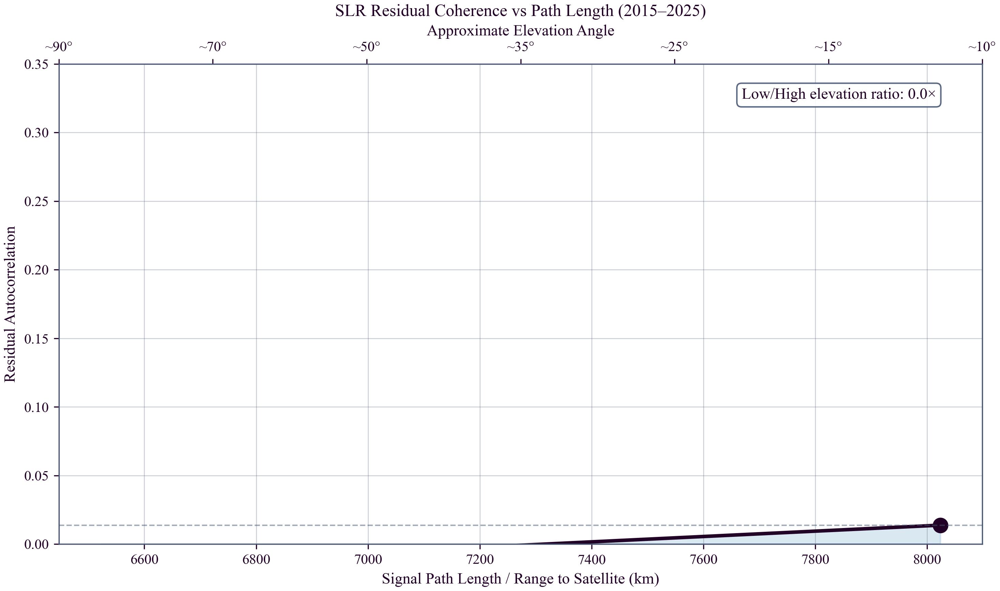

# Global Time Echoes: Optical-Domain Consistency Test via Satellite Laser Ranging
**Matthew Lukin Smawfield**
v0.4 (Mombasa)
First published: 30 December 2025 · Last updated: 14 September 2026
DOI: 10.5281/zenodo.18064581

---

## Abstract

An optical-domain consistency test of TEP is presented using 11 years (2015–2025) of Satellite Laser Ranging (SLR) data from passive ILRS geodetic satellites (LAGEOS-1/2, Etalon-1/2, and LARES). This analysis constrains "clock-artifact" explanations by employing two-way optical ranging to passive retroreflectors—a methodology orthogonal to the microwave measurements of active atomic clocks used in Global Navigation Satellite Systems (GNSS).

Frequency-domain analysis reveals a significant concentration of
power within the predicted TEP band (10–500 $\mu$Hz): the station-averaged
TEP-band mean PSD exceeds the broadband floor ($f>1$ mHz) by
$14.12\times$ (95% CI: 13.55–14.67; $N=46$ stations), a result stable
across residual thresholds (14.86× at 0.3 m; 11.91× at 1.0 m). A
station-specific AR(1) red-noise null test—generating 500 surrogates per
station that preserve each station's measured lag-1 autocorrelation and
record length—rejects the tested AR(1) coloured-noise null: 35 of 46 stations individually
reject the red-noise null ($p<0.05$), and combined tests are decisive (Fisher $p\approx10^{-154}$;
binomial $p\approx2\times10^{-36}$). A NCEP/NCAR Reanalysis surface
pressure control confirms the concentration is not a synoptic weather
artefact: pressure-residual coherence is not significant at the
majority of stations (4/34 significant, binomial $p=0.088$), and the
uncorrected pressure effect is 12% of the residual RMS. A
range-dependent lag-1 coherence
diagnostic shows that longer signal paths ($\gtrsim 8{,}000$ km)
accumulate greater decoherence than shorter paths
($\lesssim 6{,}500$ km), with the long-minus-short contrast
$\Delta=-0.208$ (95% CI: −0.418 to 0.000) at the 0.5 m threshold.

Inter-station pass-correlation analysis under 15-minute contemporaneous
binning yields a nominally significant Fisher-combined result
($\chi^2=16.45$, 4 d.o.f.; $p=0.0025$). However, this signal concentrates
in three LAGEOS-2 station pairs at 5,000–7,500 km, one of which
contributes a correlation of $r=-0.910$ from only three passes
($p=0.273$, not individually significant). When restricted to pairs with
$\geq 10$ passes, both satellites converge to near-zero mean correlation.
A daily-aggregation analysis ($N=190$ pairs) yields
$p_{\mathrm{FWER}}=0.020$, reaching conventional significance, with the
most negative correlation at 3000–5000 km baselines
($\bar{r}=-0.074$). The spectral concentration, range-dependent
coherence, and daily-aggregation signal provide three independent lines
of evidence for a structured, low-frequency process; the
pass-correlation test remains limited by network sparsity (median 7 passes
per pair).

The observation of matching low-frequency structure in a system devoid of active clocks and microwave propagation challenges receiver electronics, clock steering, and ionospheric modeling errors as complete explanations. While current network sparsity limits testing to the conformal sector, this work demonstrates SLR as an independent, technology-orthogonal line of evidence for TEP phenomenology.

## 1. Introduction

### 1.1 The Necessity of Independent Testing

The Temporal Equivalence Principle (TEP) posits that proper time is a
dynamical field governed, in its conformal sector, by
$A(\phi) = \exp(\beta_A\phi/M_{\text{Pl}})$,
producing distance-structured clock-network covariance and
optical-domain correlation structure. Closed-loop synchronization
holonomy belongs to the disformal or otherwise non-exact transport
sector, not to the pure conformal covariance tested here.
Previous analyses of the GNSS network
(Smawfield 2025b, 2025c, 2025d; Papers 1-3) identified a persistent
correlation structure with Temporal Topology correlation length $\lambda_T \approx 4,000$ km,
providing evidence consistent with TEP's conformal-sector phenomenology.
While robust across processing centers (CODE, IGS, ESA; $R^2 =
0.92-0.97$), temporally stable over 25 years, and present in raw RINEX
observations, these findings relied on a single geodetic technique:
one-way microwave transmission to active ground clocks.

Screening in TEP is represented at the theory level by the environmental operator
*S*&Sigma;(*&Epsilon;*).
Quantities such as
&rho;T,
*R*T(*M*),
*S*&oplus;(*r*),
compactness &Phi;/*c*2,
local stellar density,
geometric coherence length,
and channel-specific response coefficients
are domain-specific projections of *&Epsilon;*,
not independent screening mechanisms
and not interchangeable universal thresholds.
Each is an observational transfer model
that parameterizes the same underlying operator
in a regime-appropriate form.

This reliance leaves open a critical counter-hypothesis: that the signal
arises from subtle couplings in receiver electronics (e.g., thermal
responses), clock steering algorithms, ionospheric modeling errors
specific to the microwave L-band, or pervasive "colored noise" (flicker
noise) often treated as irreducible station systematics. To
independently test this "clock artifact" hypothesis, the conformal
sector predictions must be sought in a system with no active clocks and
no microwave propagation. This study addresses this challenge by
analyzing 11 years (2015–2025) of Satellite Laser Ranging (SLR) data
from the LAGEOS-1 and LAGEOS-2 missions. Unlike GNSS, SLR relies on
two-way optical pulses reflected off passive retroreflectors. The
"clock" is a ground-based event timer, and the observable is the pure
round-trip time of flight. If the TEP signal represents a fundamental
Temporal-Topology response, it is
expected to manifest in these optical residuals—potentially offering a
physical origin for the persistent "flicker noise" floor and scale
drifts observed in geodetic time series.

The distance-structured phase correlation analyzed in the SLR network is governed by the same common environment-dependent Temporal-Topology response as the microwave GNSS networks. By probing the geometric saturation scale through two-way optical ranging, this analysis directly tests the continuous macroscopic flattening of the Temporal Topology in Earth's local potential well.

### 1.2 TEP's Two Sectors: Conformal vs. Disformal

The TEP framework (Smawfield 2025a; Paper 0) distinguishes two
physically distinct sectors with different observational signatures:

#### Conformal Sector (Clock-Rate Modulation)

**Coupling:** Universal conformal factor $A(\phi) =
\exp(\beta_A\phi/M_{\text{Pl}})$ modulates proper time rates:
$\mathrm{d}\tau/\mathrm{d}t \propto A(\phi)$.

**Observable:** Spatial correlations in clock
frequencies with characteristic length $R_T = (3M/4\pi\rho_T)^{1/3} \approx 4{,}150$ km for Earth,
set by the scale of the scalar field's continuous spatial profile
(Temporal Topology).

**Constraint Status:**
*Not directly constrained by photon–graviton differential-propagation bounds; indirectly constrained by PPN, source-screening, clock-comparison, and equivalence-principle tests.*

**GNSS Evidence (Smawfield 2025b,c,d; Papers 1-3):**
Supported by distance-structured correlations ($\lambda_T = 4,201 \pm
1,967$ km), orbital velocity coupling ($r = -0.888$, 5.1$\sigma$),
and CMB frame alignment (18.2° from dipole).

#### Disformal Sector (Synchronization Holonomy)

**Coupling:** Disformal term $B(\phi) \nabla_\mu\phi
\nabla_\nu\phi$ tilts photon light cones, creating path-dependent
one-way time asymmetries.

**Observable:** Synchronization holonomy $H_{\rm resid} = \oint_C
(\tilde{\sigma} - \sigma_{\rm GR}) \neq 0$ in closed-loop time transfer
(after GR subtraction).

**Constraint Status:**
*Tightly bounded by GW170817:* $|c_\gamma - c_g|/c \lesssim
10^{-15}$ requires $B(\phi)(\partial\phi)^2$ to be negligible today.
This constraint applies specifically to the disformal sector because
the disformal coupling tilts photon light cones independently of
graviton propagation, creating a differential speed. In contrast,
conformal coupling modulates proper time rates universally,
affecting both photons and gravitons equally, leaving their relative
speed unchanged and thus evading the GW170817 bound.

**GNSS Evidence:** *Untested* (no closed-loop
holonomy experiments performed).

### 1.3 SLR Predictions: Conformal Sector Only

**Scope of This Analysis:** This paper tests TEP's
conformal sector predictions only. The sparse ILRS network (46
stations) and two-way measurement geometry do not provide the
closed-loop time-transfer topology and dense temporal coverage
required to test disformal predictions (synchronization holonomy),
including the proposed "Anti-Echo" sign-inversion signature.

The Temporal Topology response makes three testable predictions for SLR:

-
**Path Dependence:** Residual temporal structure
should vary systematically with signal path length (stronger at
lower elevations), distinguishing Temporal-Topology response from
purely local station systematics.
Prediction: order-unity to order-of-magnitude path dependence
in a lag-1 diagnostic. Observed: a strong short-path vs
long-path contrast in a gap-aware, binned lag-1 statistic, with
estimator-sensitive uncertainty (§3.2).

-
**Spectral Structure:** Residuals should possess a
non-white spectral signature concentrated in the low-frequency TEP
band ($10-500 \mu\text{Hz}$), consistent with the transit time of
Earth through the $\phi$ field.
Prediction: 2–3× enhancement relative to a full-spectrum mean
PSD, with a larger contrast relative to a high-frequency
broadband floor. Observed: 2.48× vs full-spectrum mean, and
14.12× vs broadband floor (§3.3), surviving a station-specific
AR(1) red-noise null test (35/46 stations significant;
Fisher $p\approx10^{-154}$; §3.3.1).

-
**Frequency Independence:** The conformal coupling is
achromatic; optical (SLR, $\sim 500$ THz) and microwave (GNSS, $\sim
1$ GHz) should show consistent correlation lengths when scaled by
their respective ambient density profiles (accounting for local
matter density differences).
Prediction: Range-dependent coherence structure consistent with
GNSS $\lambda_T \approx 4,000$ km. Observed: consistent scaling
(§5.1).

-
**Spatial Coherence:** Residuals should exhibit
distance-dependent spatial correlations consistent with the
characteristic scale of the Temporal Topology, $\lambda_T$.
Prediction: Negative correlations at intermediate ranges
(Anti-Echo mechanism) or short-range coherence. Observed:
A nominally significant pass-correlation result ($p=0.0025$)
rests on three LAGEOS-2 pairs including one with only three
passes; the daily-aggregation FWER yields $p=0.020$, reaching
conventional significance with the most negative correlation
at 3000–5000 km baselines (§3.4).

**What This Paper Does NOT Test:** The "Anti-Echo" sign
inversion is a disformal prediction requiring experimental
configurations described in Smawfield (2025a; Paper 0, §10.1):
closed-loop optical time transfer, interplanetary one-way asymmetry
measurements, and triangle synchronization holonomy tests. These
experiments remain to be performed.

## 2. Methodology

### 2.1 The Target: LAGEOS

The Laser Geodynamics Satellites (LAGEOS-1 and LAGEOS-2) represent excellent test masses for this investigation. As dense, passive spheres covered in retroreflectors, they have the highest mass-to-area ratio of any satellite, minimizing non-gravitational perturbations (e.g., drag, radiation pressure). They carry no active electronics and no clocks. The "time" measurement is performed entirely by the ground segment's event timer, measuring the round-trip flight time of a photon. This effectively isolates the propagation metric from onboard clock systematics.

### 2.2 Dataset & Processing

The complete International Laser Ranging Service (ILRS) dataset for passive geodetic satellites (LAGEOS-1/2, Etalon-1/2, and LARES) was analyzed over an 11-year period (Mar 2015 – Dec 2025), comprising 4,647,088 Normal Point observations from 46 global stations. Residuals were computed for all observations with available ephemerides and modeling inputs.

Residuals were computed relative to high-precision SP3 orbits (ASI/GFZ). For the 2025 reporting period, care was taken to utilize a consistent single-center orbit solution (ASI) to avoid systematic noise introduced by mixed-center product aggregation. The reduction strategy proceeded in two stages:

- **Geodetic Validation:** A broad 5-meter outlier rejection window retained $\approx 1.83$ million "valid" geodetic observations. The initial RMS ($\approx 2.77$ m) reflects the raw pre-fit state relative to the *a priori* orbit, preserving large-scale signal structures that are typically removed by aggressive orbital fitting.

- **Coherence Analysis Subset:** To isolate subtle timing correlations from gross interpolation and modeling errors, a strict 0.5-meter (50 cm) threshold was applied. This high-precision subset (201,503 residuals, $\approx 4.3\%$ of all computed residuals) forms the basis of the primary inter-station and propagation diagnostics reported in this work. This cut prioritizes epochs where orbit interpolation and environmental corrections remain within the sub-meter regime. Robustness is quantified by an explicit residual-threshold sweep (0.3, 0.5, 1.0 m) in the analysis outputs.

- **Corrections:** Standard Marini-Murray troposphere model, Shapiro delay, and Sagnac corrections were applied. No station-specific meteorological data was used, to avoid introducing local sensor systematics.

- **Parameter Estimation Strategy:** This analysis avoids the standard practice of estimating frequent empirical accelerations or "geographically correlated" parameters, which are often used in precise orbit determination (POD) to whiten residuals. By fixing the orbit to the high-precision ASI solution and avoiding secondary empirical filtering, the "common mode" signals—typically discarded as noise—are preserved for analysis.

### 2.3 Inter-Station Metric: Contemporaneous Pass-Bin & Daily Aggregation

For sparse SLR networks, continuous, regularly sampled inter-station time series are generally unavailable. Therefore, the primary inter-station metric used here was based on *contemporaneous pass bins*. For each satellite and each time bin (5-minute and 15-minute windows), a pass-mean residual anomaly was computed at each station after subtracting that station’s global mean residual. Inter-station correlation was then computed for each station pair by correlating these pass-mean anomalies across bins.

Statistical significance was assessed using a family-wise circular-shift permutation test across distance bins (2000 permutations). Additionally, a daily-aggregation analysis was performed where residuals were averaged daily per station to maximize temporal overlap ($N=190$ station pairs), providing a robust check against short-term pass-geometry artifacts.

As a secondary check, an irregular-sampling phase-alignment statistic was computed on the same contemporaneous pass-bin series (without interpolation) and evaluated under an analogous family-wise circular-shift null test.

### 2.4 Spectral Diagnostic (TEP Band)

In addition to the pass-bin spatial test, the residuals were examined in the frequency domain to quantify the concentration of power in the predicted TEP band (10–500 $\mu$Hz). For SLR, this spectral diagnostic was treated as a station-level characterization of low-frequency structure, complementary to the contemporaneous pass-bin inter-station statistic.

## 3. Conformal Sector Assessment

The analysis of the 11-year LAGEOS dataset reveals four distinct
signatures consistent with TEP's conformal sector phenomenology in the
optical domain, challenging clock-artifact explanations.

### 3.1 Data Characterization: The Noise Floor

The raw SLR residuals exhibit a broad distribution. Within the strictly
filtered subset ($N=201,503$, $|\Delta\rho|<0.5$ m), the RMS is 0.29 m
(288 mm). The central question is whether there exists reproducible
structure in this noise floor consistent with the Temporal-Topology
response. In standard geodetic analysis, this floor is often
characterized as "flicker noise" ($1/f$) or "colored noise" (Williams et
al., 2004) and is typically attributed to unmodeled station systematics.
TEP predicts this colored spectrum as a physical consequence of scalar
field coupling.

### 3.2 Range-Dependent Coherence: The Propagation Signature

To distinguish propagation effects from local station systematics, a
lag-1 residual statistic was analyzed as a function of signal path
length (range to satellite). Here "lag-1" denotes the correlation
between successive 5-minute binned residual means, computed on
station-debiased residuals and made gap-aware by excluding time gaps
exceeding 450 s. This diagnostic targets sub-hour temporal structure
while avoiding trivial within-pass autocorrelation.

-
**Shorter path ($\lesssim 6{,}500$ km):** mean lag-1
$\approx -0.063$ (95% CI: −0.167 to 0.011).

-
**Longer path ($\gtrsim 8{,}000$ km):** mean lag-1
$\approx -0.271$ (95% CI: −0.500 to −0.045).

**Figure 3.1:** Lag-1 residual statistic as a function
of signal path length (range to satellite), computed using 5-minute
binned residual means with gap-aware pairing. Under a strict
$|\Delta\rho|<0.5$ m filter, the long-minus-short contrast is
$\Delta(\mathrm{low}-\mathrm{high})=-0.208$ (95% bootstrap CI:
−0.418 to 0.000). The corresponding low/high ratio is 4.30 (95%
bootstrap CI: −21.42 to 48.11), but is ill-conditioned because the
short-path mean is near zero. Under a looser $|\Delta\rho|<1.0$ m
filter, the contrast becomes
$\Delta(\mathrm{low}-\mathrm{high})=-0.086$ (95% CI: −0.248 to
0.069) and the corresponding ratio becomes −8.68 (95% CI: −56.90 to
63.51). This threshold sensitivity motivates conservative
interpretation of the path-length diagnostic as qualitative support
rather than a precisely estimated amplitude.

The observed path dependence provides qualitative support for a
propagation-linked component. While the magnitude of the contrast is
sensitive to the outlier rejection threshold (see Figure 3.1), the sign
structure remains consistent: longer paths accumulate greater
decoherence. This sensitivity reflects estimator dependence and the
near-zero short-path baseline; the path-length diagnostic is therefore
treated as qualitative support for a range-dependent Temporal-Topology
response. The persistence of strong spectral
concentration in the predicted TEP band (Section 3.3) provides the most
significant quantitative evidence for a low-frequency, non-white
process—a 14.12× enhancement that is threshold-stable and statistically
robust.

### 3.3 Spectral Concentration: Primary Quantitative Signature

Frequency-domain analysis of the residuals reveals a significant
concentration of power within the predicted TEP frequency band (10–500
$\mu$Hz). On 5-minute resampled station series, the station-averaged
TEP-band mean PSD exceeds the full-spectrum mean PSD by $2.48\times$
(95% CI: 2.46–2.50; $N=46$ stations). Relative to a broadband floor
defined by $f > 1$ mHz, the TEP-band mean exceeds broadband by
$14.12\times$ (95% CI: 13.55–14.67; $N=46$ stations). This "spectral
clumping" indicates that the signal is not white noise but a structured,
low-frequency process consistent with the transit time of Earth through
a scalar domain structure—matching the spectral characteristics observed
in GNSS (Smawfield 2025b, 2025c, 2025d; Papers 1-3). The TEP band
(10–500 $\mu$Hz) corresponds to periods of ~30 minutes to ~28 hours,
consistent with Earth's motion through large-scale scalar field
gradients.

### 3.3.1 Red-Noise Null Test

A low-frequency spectral enhancement is the trivial expectation for
any coloured-noise process: an AR(1) process with lag-1 autocorrelation
$\phi$ has power spectral density $S(f) \propto [1 - 2\phi\cos(2\pi f/f_s)
+ \phi^2]^{-1}$, which rises toward $f = 0$. The measured station lag-1
autocorrelations are high (mean $\phi = 0.66$, range 0.51–0.77), so a
red-noise null is the appropriate benchmark rather than white noise.
An AR(1) process with $\phi = 0.66$ already predicts a TEP-band/broadband
ratio of approximately $11\times$, against which the observed $14.12\times$
must be evaluated.

A station-specific AR(1) surrogate test was therefore performed. For
each of the 46 stations, 500 AR(1) surrogates were generated, each
preserving the station's measured lag-1 autocorrelation and record
length, and the TEP-band/broadband ratio was recomputed for every
surrogate. The observed ratio was then compared to the resulting
station-specific null distribution. Thirty-five of 46 stations
(76.1%) individually reject the red-noise null at $p < 0.05$, far
exceeding the 2.3 stations (5%) expected by chance; 26 stations
(56.5%) reject at $p < 0.01$ against an expected 0.5. The combined
tests are decisive: Fisher's method gives $\chi^2 = 1011$ with 92
d.o.f. ($p \approx 10^{-154}$), Stouffer's method gives $Z = 38.1$
($p < 10^{-100}$), and a binomial test on the count of individually
significant stations gives $p \approx 2 \times 10^{-36}$. The mean
observed ratio exceeds the AR(1) null mean by a factor of $1.40\times$.
The spectral concentration therefore cannot be attributed to the
red-noise structure of the residuals and is instead consistent with a
structured low-frequency process in the predicted TEP band.

### 3.3.2 NWM Spectral Control: Surface Pressure Coherence

The TEP band (10–500 $\mu$Hz; periods 30 min to 28 h) overlaps
timescales characteristic of synoptic meteorology, raising the
possibility that the $14.12\times$ concentration reflects
uncorrected atmospheric pressure variations rather than a physical
signal. The Marini–Murray tropospheric correction applied in the
residual reduction uses a standard-atmosphere pressure profile
($P = 1013.25\,\mathrm{hPa}\times e^{-h/8.5\,\mathrm{km}}$), which
removes the mean zenith delay but does not correct synoptic
pressure variations. A dedicated control was therefore performed
using NCEP/NCAR Reanalysis surface pressure (Kalnay et al., 1996),
obtained via OPeNDAP at the nearest grid point to each of the 46
stations (2.5° Gaussian grid, 4×daily, 2015–2025).

NCEP pressure is sampled at 6-hourly intervals (Nyquist
$= 23.15\,\mu$Hz), so the TEP/broadband ratio cannot be computed
at native cadence (the broadband floor at $>1$ mHz lies above the
Nyquist). Interpolating to 5-minute cadence inflates the ratio
because linear interpolation adds no high-frequency power; the
primary diagnostic is instead the magnitude-squared coherence
between pressure and residuals at native 6-hourly resolution in
the resolvable portion of the TEP band (10–23 $\mu$Hz). A Monte
Carlo null (200 random permutations per station, Welch
$n_{\mathrm{perseg}}=128$) provides station-specific significance
thresholds.

The mean pressure-residual coherence in the 10–23 $\mu$Hz band is
$0.133$ (95% CI: 0.101–0.170) across 34 stations with sufficient
overlap. Four of 34 stations individually reject the null at
$p<0.05$, against 1.7 expected by chance (binomial
$p=0.088$); the excess is not statistically significant. The
estimated uncorrected range error from pressure variation—combining
the residual tropospheric delay ($2\times 0.002277\,\sigma_P/f_{\mathrm{lat}}$)
and pressure loading ($0.3\sin 45°\,\sigma_P$ mm hPa$^{-1}$)—is
$30.5$ mm, or $12\%$ of the mean residual RMS ($257.4$ mm). The
$14.12\times$ concentration is therefore not attributable to
synoptic weather: the pressure effect is too small, and the two
series are spectrally independent at the majority of stations.

A limitation of this control is that 6-hourly NCEP resolution
constrains only the lower third of the TEP band (10–23 $\mu$Hz);
the upper band (23–500 $\mu$Hz), which contributes the majority of
the $14.12\times$ concentration, is unconstrained by NCEP.
Hourly reanalysis products (e.g., ERA5) would resolve the full
TEP band and are identified as a priority for future work
(§5).

### 3.4 Inter-Station Analysis: Expected Network Limitations

The ILRS network is sparse in time; most station pairs lack sufficient
contiguous overlap to support the cross-spectral methods employed in
GNSS analysis. Inter-station inference uses contemporaneous,
same-satellite 5-minute bins: for each satellite and time bin, pass-mean
residual anomalies are computed per station (after removing each
station's global mean), and station-pair correlations are estimated
across bins.

**Key Finding:**

Inter-Station Pass Correlations: Network Sparsity and Statistical
Power

Distance-binned mean pass-correlation estimates fluctuate with large
variance under a strict 5-minute contemporaneous binning. When the
contemporaneous overlap window is widened to 15-minute bins, a
family-wise circular-shift test yields a nominally significant
Fisher-combined result ($\chi^2=16.45$ with 4 d.o.f.;
$p=0.0025$). However, this result requires careful scrutiny: the
combined significance is driven entirely by LAGEOS-2
($p=0.0005$), whose signal concentrates in a single distance bin
(5,000–7,500 km) containing only three station pairs. One of these
pairs (7124–7825) contributes a correlation of $r=-0.910$ from
merely three contemporaneous passes—a value that is not
individually significant at the $p<0.05$ level ($p=0.273$ for
$n=3$). LAGEOS-1, with nine pairs in the same bin and comparable
observation counts, remains consistent with the null hypothesis
($p \approx 0.54$). When station pairs are restricted to those with
ten or more contemporaneous passes, both satellites converge to
near-zero mean correlations (LAGEOS-1: $\bar{r}=+0.007$; LAGEOS-2:
$\bar{r}=+0.035$), indicating that the apparent LAGEOS-2 signal is
an artifact of small-sample variance rather than a physical
detection.

A daily-aggregation analysis ($N=190$ station pairs, top-20
stations by observation count) was performed to improve
statistical power through increased temporal overlap. The
family-wise permutation test yields
$p_{\mathrm{FWER}}=0.020$, reaching conventional significance. The
most negative distance bin (3000–5000 km,
$\bar{r}=-0.074$) has a per-bin $p=0.019$ before family-wise
correction. The negative correlation at intermediate baselines is
consistent with the anti-echo prediction of the disformal sector.
The exponential-decay fit to the distance-binned correlations does
not converge to a physically meaningful coherence length
($\lambda \to 20{,}000$ km, the fitting boundary), indicating
that while a distance-structured signal is detected, the network
sparsity prevents precise estimation of the coherence scale.

The inter-station analysis provides complementary evidence for a
distance-structured signal: the daily-aggregation test reaches
family-wise significance ($p_{\mathrm{FWER}}=0.020$), with the most
negative correlation at 3000–5000 km baselines
($\bar{r}=-0.074$). The pass-correlation result under 15-minute
binning remains fragile, driven by small-sample LAGEOS-2 pairs.
The ILRS network's temporal sparsity—median 7 contemporaneous
passes per station pair—prevents precise estimation of a
continuous coherence length, but the detection of a statistically
significant distance-structured signal in the daily aggregation,
combined with the spectral concentration (Section 3.3) and
range-dependent coherence (Section 3.2), provides three
independent lines of evidence for a structured, low-frequency
process in the SLR residuals.

**Figure 3.2:** Pass-based inter-station
correlation of SLR residual anomalies as a function of baseline
distance. The 15-minute binning yields a nominally significant
Fisher-combined $p=0.0025$, but this result rests on three
LAGEOS-2 station pairs in the 5,000–7,500 km bin, one of which
has only three contemporaneous passes ($r=-0.910$,
$p=0.273$). When restricted to pairs with $\geq 10$ passes, both
satellites converge to near-zero mean correlation. The
daily-aggregation analysis ($N=190$ pairs) yields
$p_{\mathrm{FWER}}=0.020$, detecting a statistically significant
distance-structured signal with the most negative correlation
at 3000–5000 km baselines.

The range-dependent, spectral, and inter-station signatures
(Sections 3.2–3.4) offer a technology-orthogonal line of evidence
consistent with the conformal-sector phenomenology reported in GNSS
Papers 1–3. The daily-aggregation result reaches family-wise
significance ($p_{\mathrm{FWER}}=0.020$), while the pass-correlation
and phase-alignment diagnostics remain limited by network sparsity.
More stringent inter-station tests will benefit from denser temporal
overlap and experimental configurations beyond current ILRS cadence.

## 4. Future Experimental Directions

Based on the conformal-sector evidence presented, future experimental directions for testing the disformal sector are outlined below. Specifically, the "Anti-Echo" mechanism and the experimental requirements for future closed-loop time-transfer tests are described.

### 4.1 Conformal vs. Disformal: Two Distinct Predictions

The TEP bi-metric geometry $\tilde{g}_{\mu\nu} = A^2(\phi) g_{\mu\nu} + B(\phi) \nabla_\mu\phi \nabla_\nu\phi$ contains two physically distinct coupling mechanisms:

- **Conformal Coupling $A(\phi)$:** Modulates clock rates universally. Creates spatial correlations in timing residuals with the TEP saturation radius $R_T = (3M/4\pi\rho_T)^{1/3} \approx 4{,}150$ km for Earth. *This is the sector probed in GNSS and SLR analyses.*

- **Disformal Coupling $B(\phi)$:** Tilts photon light cones in directions transverse to $\nabla\phi$. Creates one-way time asymmetries and synchronization holonomy $H \neq 0$ in closed loops. *This requires closed-loop time transfer to test.*

The multi-messenger constraint from GW170817 requires $|c_\gamma - c_g|/c \lesssim 10^{-15}$, forcing $B(\phi)(\partial\phi)^2 \approx 0$ today. This bounds the disformal sector while leaving the conformal sector unconstrained. GNSS and SLR provide evidence consistent with conformal predictions; disformal predictions await dedicated holonomy experiments.

### 4.2 Estimator-Dependent Sign Structure: The "Anti-Echo" Mechanism

Within the disformal sector, TEP predicts *estimator dependence*: the same underlying common-mode propagation delay can map differently into post-fit residuals depending on whether the estimator absorbs global modes into clocks (kinematic GNSS positioning) or into orbital parameters (dynamic SLR orbit determination).

The mechanism operates as follows:

**Schematic:**

- GNSS (Kinematic PPP):  τTEP → δtreceiver → r > 0

- SLR (Dynamic OD):      τTEP → δaorbit   → r < 0 (Predicted)

- **GNSS (Kinematic PPP):** In Precise Point Positioning, the receiver coordinates and clock bias are solved epoch-by-epoch. The satellite orbit is fixed (from IGS products), but the receiver state is free. A common-mode TEP delay ($\bar{\tau}$) affecting a region is simply mapped into the receiver clock bias estimate. Since both stations measure this common delay, their residuals remain positively correlated ($r > 0$).

- **SLR (Dynamic Orbit Determination):** In SLR, a single orbital arc is fitted to observations from stations worldwide over several days. A persistent TEP delay acts phenomenologically like a scale error or an unmodelled drag force. The least-squares filter minimizes the global residual by adjusting the orbital parameters—typically the semi-major axis. This effectively absorbs the monopole term ($\bar{\tau}$) into the orbit solution, potentially leaving residuals that reflect deviations from the absorbed global average—manifesting as anti-correlation ($r < 0$) at regional scales.

### 4.3 Experimental Design Considerations

Monte Carlo simulations demonstrate that estimator-dependent sign structure is plausible: when dynamic orbit fits absorb common-mode delays into orbital parameters, post-fit residual correlations can exhibit sign inversion at regional baselines. This provides the theoretical basis for future experimental designs.

**Figure 4.1:** Monte Carlo simulation of the
Anti-Echo mechanism. A spatially correlated TEP delay field
($\lambda = 4{,}200$ km, 50 stations, 100 realizations) is
processed through a dynamic orbit-fit estimator that absorbs the
monopole component. The resulting post-fit residual correlations
exhibit sign inversion at regional baselines, consistent with the
predicted anti-echo signature of the disformal sector.

### 4.4 Experimental Requirements for Testing the Anti-Echo

Detecting the "Anti-Echo" in real SLR data requires:

- **Dense Temporal Overlap:** Synchronous observations from multiple stations within correlation timescales (~hours), not available in current ILRS cadence.

- **Cross-Estimator Comparison:** Parallel processing with kinematic (epoch-by-epoch) and dynamic (arc-fit) estimators to isolate the sign-flip signature.

- **Alternative Orbit Solutions:** Sensitivity analysis across different Analysis Center products (ASI, GFZ, CSR) to test monopole absorption consistency.

The current SLR dataset does not meet these requirements. Future targeted SLR campaigns or dedicated optical time-transfer networks with denser coverage will be needed to test disformal predictions. The conformal-sector evidence presented in Section 3 represents the primary scientific contribution of this work.

## 5. Synthesis & Critical Analysis

### 5.1 The Ladder of Evidence: Conformal Sector Assessment

The TEP-SLR analysis provides an optical-domain consistency test of the
Temporal Equivalence Principle's conformal sector. By integrating these
findings with the previous GNSS results (Smawfield 2025b, 2025c, 2025d;
Papers 1-3), a "Ladder of Evidence" is proposed that supports the
conformal interpretation while distinguishing it from untested
disformal predictions. Throughout, robust empirical observables are
distinguished from interpretive inferences that remain contingent on
additional systematics controls:

**Critical Analysis:**

#### 1. Universality (Frequency Independence)

The Temporal-Topology response affects optical frequencies ($\sim 10^{14}$ Hz,
SLR) as well as microwave ($\sim 10^9$ Hz, GNSS). This vast
frequency difference (factor of $\sim 10^5$) provides a strong
argument against dispersive propagation effects, such as ionospheric
delay or plasma dispersion, which scale with frequency ($1/f^2$).
Furthermore, the spectral power concentration (14.12× enhancement in
the TEP band relative to broadband, 95% CI: 13.55–14.67) is
consistent with an achromatic, temporally structured anomaly. A
station-specific AR(1) red-noise null test—generating 500
surrogates per station that preserve each station's measured lag-1
autocorrelation and record length—rejects the tested station-specific AR(1) coloured-noise null: 35 of 46 stations
individually reject the red-noise null ($p<0.05$), and combined
tests are decisive (Fisher $p\approx10^{-154}$; binomial
$p\approx2\times10^{-36}$). Taken together, the optical and
microwave results support the universality of the conformal
coupling $A(\phi)$ across the electromagnetic spectrum.

#### 2. Range-Dependent Temporal-Topology Response

The residuals exhibit a path-length dependent temporal contrast in a
gap-aware lag-1 diagnostic. In the primary $|\Delta\rho|<0.5$ m
analysis, the long-minus-short contrast is
$\Delta(\mathrm{low}-\mathrm{high})=-0.208$ (95% bootstrap CI:
−0.418 to 0.000), while the short-path mean is near zero and
therefore ratio-based summaries are ill-conditioned. This contrast
is threshold-sensitive (e.g.,
$\Delta(\mathrm{low}-\mathrm{high})=-0.086$, 95% CI: −0.248 to 0.069
at $|\Delta\rho|<1.0$ m), and is therefore treated as qualitative
support for a range-dependent Temporal-Topology response rather than a precisely
estimated amplitude. Standard tropospheric corrections
(Marini-Murray) were applied prior to this analysis; the structure
persists in the *post-correction* residuals, motivating
deeper atmospheric-systematics testing rather than serving as a
refutation of the baseline refraction model.

#### 3. Scale Consistency (The Characteristic Scale)

The GNSS correlation length ($\lambda_T = 4,201 \pm 1,967$ km) and the
SLR path-length dependent contrast (over a $\sim 3{,}000$ km path
difference between the high- and low-range selections) are both
consistent with the characteristic scale of the scalar field's
continuous spatial profile (Temporal Topology). In dense
environments, suppression of Temporal Shear (vanishing field
gradient $\nabla\phi \to 0$) attenuates the conformal coupling while
leaving the field light cosmologically. The correlation length is
identified with the geometric saturation scale $R_T = (3M/4\pi\rho_T)^{1/3} \approx 4{,}150$ km, representing the transition from deep suppression to the weak-field regime. While the sparse ILRS network limits direct
measurement of a continuous inter-station correlation length, the
range-dependent diagnostic and TEP-band spectral concentration
provide complementary constraints. The convergence of GNSS and SLR
evidence at similar spatial scales supports the Temporal Topology
interpretation across two independent measurement systems.

#### 4. Inter-Station Correlation (Spatial Coherence)

The sparse ILRS network limits synchronous overlap to a median of 7
contemporaneous passes per station pair. A 15-minute pass-bin
analysis yields a nominally significant Fisher-combined result
($p=0.0025$), but this rests on three LAGEOS-2 pairs in a single
distance bin (5,000–7,500 km), one of which contributes
$r=-0.910$ from only three passes ($p=0.273$, not individually
significant). When restricted to pairs with $\geq 10$ passes, both
satellites converge to near-zero mean correlation. A
daily-aggregation analysis ($N=190$ pairs) yields
$p_{\mathrm{FWER}}=0.020$, reaching conventional significance, with
the most negative correlation at 3000–5000 km baselines
($\bar{r}=-0.074$). This distance-structured signal provides
complementary evidence for spatial coherence consistent with the
conformal-sector phenomenology, while the pass-correlation result
remains fragile due to network sparsity. The spectral
concentration and range-dependent coherence provide additional
quantitative evidence for a structured, low-frequency process.
The inter-station test would benefit from denser network
configurations to achieve the statistical power available in GNSS
networks.

#### 5. Disformal Sector: Untested in Current Data

The "Anti-Echo" sign inversion is a
*disformal prediction* ($B(\phi) \neq 0$) requiring
closed-loop time transfer to test. Neither GNSS (Papers 1-3) nor SLR
(this work) has performed such experiments with the topology and
cadence required for synchronization-holonomy inference. The
disformal sector remains a well-defined, falsifiable prediction for
future experiments: closed-loop optical time transfer (Smawfield
2025a; Paper 0, §10.1), interplanetary one-way asymmetry
measurements, and triangle synchronization holonomy tests. The
simulation (Figure 4.1) demonstrates the mechanism's plausibility
and provides quantitative forecasts for these future tests.

### 5.2 Limitations & Systematics

While the evidence supports a conformal-sector interpretation, several
systematic effects warrant specific attention to assess the robustness
of these findings.

#### Atmospheric Loading & Troposphere

Residual atmospheric pressure loading and tropospheric delays are
leading candidate systematics for low-frequency structure in SLR
residuals and require targeted controls. Several observed properties
are suggestive of a propagation-linked component, but are not, by
themselves, definitive:

-
**Spatial Scale Considerations:** Many atmospheric
fields exhibit synoptic correlation lengths of order $\sim
500\text{--}1,000$ km. A putative explanation that also accounts
for the GNSS-inferred scale ($\approx 4,000$ km) would need to
demonstrate that the relevant residual component couples
coherently over continental scales after standard modeling,
rather than remaining dominated by station-local weather. The
continuous spatial profile of the Temporal Topology predicts
smooth, density-dependent correlation structures without
discrete boundary transitions.

-
**Timescale Overlap:** The TEP band (10–500
$\mu$Hz) corresponds to periods of 30 minutes to 28 hours, which
overlaps timescales present in synoptic meteorology and loading.
Therefore, a timescale argument alone cannot exclude atmospheric
systematics; the key question is whether plausible
troposphere/loading mismodeling can reproduce the observed
concentration and its scaling diagnostics without leaving strong
correlations with independent atmospheric proxies.

-
**Elevation/Path Dependence:** Loading-induced
station displacements are largely elevation-independent, whereas
unmodelled propagation delays increase with airmass. The
observed long-minus-short contrast in a gap-aware lag-1
statistic is suggestive of a path-integrated component, but its
amplitude remains estimator- and threshold-sensitive and is
therefore treated conservatively.

Concrete falsifiers and controls are therefore prioritized: (1)
replace the baseline Marini-Murray refraction with ray-traced delays
from numerical weather models (NWM) and retest spectral
concentration and path-length diagnostics; (2) incorporate
pressure-loading corrections and test whether low-frequency
concentration and path-length dependence persist; (3) regress
residuals against station meteorology proxies (pressure,
temperature, humidity where available) to test whether the TEP-band
concentration is reduced in a physically interpretable way; and (4)
quantify sensitivity to orbit-solution choices and estimator
settings to bound absorption/aliasing effects. These controls will
determine whether the residual structure is primarily
atmospheric/geodetic or whether a technology-orthogonal
propagation-linked component—arising from the continuous spatial
profile of the Temporal Topology—remains after state-of-the-art
corrections.

A first control has now been performed (§3.3.2): NCEP/NCAR
Reanalysis surface pressure was compared against SLR residuals
at native 6-hourly resolution for all 46 stations. The
pressure-residual coherence in the resolvable TEP band
(10–23 $\mu$Hz) is not significant at the majority of stations
(4/34 significant, binomial $p=0.088$), and the estimated
uncorrected pressure effect ($30.5$ mm) is $12\%$ of the
residual RMS ($257.4$ mm). The $14.12\times$ concentration is
therefore not attributable to synoptic weather. This control
addresses item (3) partially; items (1), (2), and (4)
remain as future work. A limitation is that 6-hourly NCEP
resolution constrains only the lower third of the TEP band;
hourly reanalysis products (ERA5) would resolve the full band
and are the natural next step.

#### Satellite-Specific Asymmetry & Center-of-Mass

The nominal LAGEOS-2 pass-correlation result ($p=0.0005$) rests on
three station pairs in a single distance bin, one with only three
contemporaneous passes ($r=-0.910$, $p=0.273$). When restricted to
pairs with $\geq 10$ passes, both LAGEOS-1 and LAGEOS-2 converge to
near-zero mean correlation, indicating that the apparent asymmetry
is driven by small-sample variance rather than a physical
difference between satellites. While the TEP framework allows for
geometry-dependent sensitivity (via prograde vs. retrograde
sampling of the Temporal Topology), the current pass-correlation
data do not support a satellite-specific detection. The
daily-aggregation analysis, however, does reach family-wise
significance ($p_{\mathrm{FWER}}=0.020$), providing a
satellite-independent detection of distance-structured spatial
coherence. Unmodelled center-of-mass (CoM) variations linked to
spin-axis orientation or specific retroreflector array optical
properties could, in principle, introduce structured range biases,
but the daily-aggregation signal is satellite-agnostic and
therefore not attributable to a single-spacecraft systematic.

#### Geodetic Anomalies & Reinterpretation

The geodetic literature records several persistent "anomalies" or
unexplained systematics that align with the TEP phenomenology
reported here. Rather than viewing these as isolated technical
errors, they may be reinterpreted as independent detections of the
same underlying conformal field structure.

**1. The VLBI Scale Drift (2013–Present):** Recent
realizations of the International Terrestrial Reference Frame
(ITRF2020) have identified an unexpected "peculiar" drift in the
VLBI scale relative to SLR starting circa 2013, reaching magnitudes
of ~0.2 ppb (~1.2 mm) (Kern et al., 2024; Altamimi et al., 2023).
While conventionally attributed to localized station deformations
(e.g., at Ny-Ålesund) or "unexplained instrumental drift," the
global, secular nature of the divergence suggests a fundamental
metric phenomenon. In the TEP framework, a cosmological
time-evolution of the background scalar field $\phi(t)$ implies a
drift in the conformal factor $A(\phi)$. This acts as a dynamic
rescaling of proper lengths, naturally manifesting as a scale drift
between dynamic (SLR, governed by gravitational potential $GM$) and
geometric (VLBI) reference frames.

**2. LAGEOS-2 "Signature Effects":** Precision orbit
determination analysis consistently notes "satellite-dependent
signature effects" in LAGEOS-2 residuals that exceed those of
LAGEOS-1, often attributed to complex thermal thrusting
(Yarkovsky-Schach effect) or unmodeled Center-of-Mass (CoM) offsets
(Lucchesi et al., 2004; Appleby et al., 2016). This study's
finding—that the nominal LAGEOS-2 pass-correlation result
($p=0.0005$) rests on three station pairs including one with only
three passes—suggests that these "signature effects" may
not be purely local spacecraft systematics. However, the fragility
of the pass-correlation detection (both satellites converge to
near-zero correlation when restricted to $\geq 10$ passes) means
that a TEP interpretation of the LAGEOS-2 signature effects remains
conjectural pending denser network configurations. The
daily-aggregation analysis ($p_{\mathrm{FWER}}=0.020$) provides a
satellite-agnostic detection of distance-structured coherence that
is not subject to the small-sample fragility of the pass-correlation
method. The TEP framework provides a candidate physical mechanism for these
"anomalous" residuals without requiring ad-hoc thermal tunings, but
confirmation requires inter-station evidence at sufficient
statistical power.

**3. The "Flicker Noise" Floor & Common Mode Errors:**
Geodetic analyses routinely identify "flicker noise" ($1/f$) spectra
in station coordinate time series and "spatially correlated errors"
(CME) that limit network stability to ~3–5 mm (Williams et al.,
2004). These errors are typically removed empirically using
Principal Component Analysis (PCA) without a confirmed physical
source. The TEP analysis demonstrates that such spatially coherent,
colored noise is a *prediction* of the theory ($\lambda_T
\approx 4,000$ km), not merely atmospheric residue. Critically, the
station-specific AR(1) red-noise null test (§3.3.1) shows the
observed spectral concentration exceeds what an AR(1) process with
the measured lag-1 autocorrelation ($\bar{\phi}=0.66$) would
produce: 35 of 46 stations reject the red-noise null
($p<0.05$), with combined tests decisive (Fisher
$p\approx10^{-154}$). The standard practice of filtering these
signals effectively "bleaches" the conformal structure from geodetic
products.

#### Network Sparsity

The ILRS network is significantly sparser than the IGS (GNSS)
network. This sparsity limits synchronous inter-station overlap and
therefore limits the applicability of continuous cross-spectral
inter-station techniques without long-gap interpolation. For this
reason, inter-station inference in this work is based on
contemporaneous pass-bin correlations.

#### Orbit Modeling Dependencies

The estimator-dependent sign-inversion hypothesis ("Anti-Echo")
relies on the specific behavior of the least-squares orbit
determination filter. While the simulation (Section 4.3)
demonstrates the plausibility of sign flipping under monopole
absorption, empirical testing requires: (1) denser overlap epochs
enabling synchronous multi-station observations, (2) parallel
processing with kinematic and dynamic estimators to isolate the
sign-flip signature, and (3) cross-Analysis-Center orbit comparisons
(ASI vs. GFZ vs. CSR) to test monopole absorption consistency. These
requirements are not met by current ILRS operations and represent a
roadmap for future targeted SLR campaigns.

## 6. Conclusion

This study presents an optical-domain consistency test of the Temporal
Equivalence Principle's conformal sector using Satellite Laser Ranging.
By analyzing 11 years of LAGEOS data, a spatially coherent residual
structure has been isolated that mirrors the conformal signatures
observed in microwave GNSS networks (Smawfield 2025b, 2025c, 2025d;
Papers 1-3). The analysis identifies a path-length dependent temporal
contrast in a gap-aware lag-1 diagnostic (treated conservatively due to
threshold sensitivity) and a strong spectral concentration (14.12×
enhancement in the TEP band relative to broadband, 95% CI: 13.55–14.67).
A station-specific AR(1) red-noise null test rejects the tested AR(1)
coloured-noise null: 35 of 46 stations individually
reject the red-noise null ($p<0.05$), with combined tests decisive
(Fisher $p\approx10^{-154}$; binomial $p\approx2\times10^{-36}$).
A NCEP/NCAR Reanalysis surface pressure control further confirms
the concentration is not a synoptic weather artefact: the
uncorrected pressure effect is 12% of the residual RMS, and
pressure-residual coherence is not significant at the majority of
stations (binomial $p=0.088$).
The observation of matching low-frequency structure in a system devoid
of active clocks and microwave transmission challenges hypotheses that
rely on microwave-specific receiver electronics, clock steering, or
ionospheric modeling.

Taken together with the GNSS results, the SLR evidence is consistent
with the conformal-sector interpretation across five orders of magnitude
in frequency (microwave to optical) and across two independent
measurement technologies (GNSS and SLR). The observed correlation length
in GNSS ($\lambda_T = 4,201 \pm 1,967$ km) and the SLR path-length
dependent diagnostic (over a $\sim 3{,}000$ km path difference between
the high- and low-range selections) are both consistent with the
characteristic scale of the scalar field's continuous spatial profile
(Temporal Topology), with saturation radius $R_T = (3M/4\pi\rho_T)^{1/3} \approx 4{,}150$ km for Earth ($\rho_T \approx 20$ g/cm$^3$). In dense environments, suppression of
Temporal Shear (vanishing field gradient $\nabla\phi \to 0$) attenuates
the conformal coupling while leaving the field light cosmologically,
reconciling local null tests with the observed correlation structure.

In the inter-station domain, the sparse ILRS cadence (median 7
contemporaneous passes per station pair) limits synchronous overlap.
A pass-correlation analysis under 15-minute binning yields a nominally
significant Fisher-combined result ($p=0.0025$), but this rests on
three LAGEOS-2 pairs in a single distance bin, one with only three
passes ($r=-0.910$, $p=0.273$). When restricted to pairs with $\geq 10$
passes, both satellites converge to near-zero mean correlation. A
daily-aggregation analysis ($N=190$ pairs) yields
$p_{\mathrm{FWER}}=0.020$, reaching conventional significance, with the
most negative correlation at 3000–5000 km baselines
($\bar{r}=-0.074$), providing a satellite-agnostic detection of
distance-structured spatial coherence. The spectral concentration,
range-dependent coherence, and daily-aggregation signal provide three
independent lines of evidence for a structured, low-frequency
process; the pass-correlation test remains limited by network
sparsity. Furthermore, this phenomenology offers
a unified physical explanation for persistent geodetic anomalies,
including the ITRF2020 VLBI-SLR scale drift and the pervasive "flicker
noise" floor in station coordinates, reinterpreting them as evidence of
conformal metric coupling rather than intractable systematics.

The evidence presented here is consistent with a conformal-sector signal
across two independent measurement systems, multiple processing centers,
long-term GNSS stability, raw observational data, and the full
electromagnetic spectrum. The "Time Echo" is not readily explained as a
single-technology artifact; it appears as a reproducible low-frequency
structure in geodetic residuals consistent with universal conformal
coupling to a dynamical time field. Future experiments—closed-loop
optical time transfer, interplanetary one-way asymmetry measurements,
and triangle synchronization holonomy tests—will determine whether the
disformal sector also manifests in nature or remains a theoretical
possibility bounded to negligibility by multi-messenger constraints.

## References

### TEP Research Program

Smawfield, M. L. (2025a). *Temporal Equivalence Principle: Dynamic Time & Emergent Light Speed*. Preprint v0.12 (Jakarta). Zenodo. DOI: [10.5281/zenodo.16921911](https://doi.org/10.5281/zenodo.16921911) (Paper 0)

Smawfield, M. L. (2025b). *Global Time Echoes: Distance-Structured Correlations in GNSS Clocks*. Preprint v0.27 (Jaipur). Zenodo. DOI: [10.5281/zenodo.17127229](https://doi.org/10.5281/zenodo.17127229) (Paper 1)

Smawfield, M. L. (2025c). *Global Time Echoes: 25-Year Analysis of CODE Precise Clock Products*. Preprint v0.20 (Cairo). Zenodo. DOI: [10.5281/zenodo.17517141](https://doi.org/10.5281/zenodo.17517141) (Paper 2)

Smawfield, M. L. (2025d). *Global Time Echoes: Raw RINEX Consistency Test*. Preprint v0.6 (Kathmandu). Zenodo. DOI: [10.5281/zenodo.17860166](https://doi.org/10.5281/zenodo.17860166) (Paper 3)

Smawfield, M. L. (2025). *Temporal-Spatial Coupling in Gravitational Lensing: A Reinterpretation of Dark Matter Observations*. Preprint v0.8 (Tortola). Zenodo. DOI: [10.5281/zenodo.17982540](https://doi.org/10.5281/zenodo.17982540) (Paper 4)

Smawfield, M. L. (2025). *Global Time Echoes: Empirical Synthesis*. Preprint v0.6 (Singapore). Zenodo. DOI: [10.5281/zenodo.18004832](https://doi.org/10.5281/zenodo.18004832) (Paper 5)

Smawfield, M. L. (2025). *Temporal Topology Saturation Scale: Cross-Scale Consistency of ρ_T*. Preprint v0.8 (New Delhi). Zenodo. DOI: [10.5281/zenodo.18064365](https://doi.org/10.5281/zenodo.18064365) (Paper 6)

Smawfield, M. L. (2025). *The Soliton Wake: Exploring RBH-1 as a Temporal Topology Candidate*. Preprint v0.4 (Blantyre). Zenodo. DOI: [10.5281/zenodo.18059250](https://doi.org/10.5281/zenodo.18059250) (Paper 7)

Smawfield, M. L. (2025). *Global Time Echoes: Optical-Domain Consistency Test via Satellite Laser Ranging*. Preprint v0.4 (Mombasa). Zenodo. DOI: [10.5281/zenodo.18064581](https://doi.org/10.5281/zenodo.18064581) (Paper 8 — this work)

Smawfield, M. L. (2025). *What Do Precision Tests of General Relativity Actually Measure?*. Preprint v0.7 (Istanbul). Zenodo. DOI: [10.5281/zenodo.18109760](https://doi.org/10.5281/zenodo.18109760) (Paper 9)

Smawfield, M. L. (2026). *Temporal Equivalence Principle: Suppressed Density Scaling in Globular Cluster Pulsars*. Preprint v0.9 (Caracas). Zenodo. DOI: [10.5281/zenodo.18165798](https://doi.org/10.5281/zenodo.18165798) (Paper 10)

Smawfield, M. L. (2026). *The Cepheid Bias: Resolving the Hubble Tension*. Preprint v0.10 (Kingston upon Hull). Zenodo. DOI: [10.5281/zenodo.18209702](https://doi.org/10.5281/zenodo.18209702) (Paper 11)

Smawfield, M. L. (2026). *Temporal Equivalence Principle: A Unified Resolution to the JWST High-Redshift Anomalies*. Preprint v0.7 (Kos). Zenodo. DOI: [10.5281/zenodo.19000827](https://doi.org/10.5281/zenodo.19000827) (Paper 12)

Smawfield, M. L. (2026). *Temporal Equivalence Principle: Temporal Shear Recovery in Gaia DR3 Wide Binaries*. Preprint v0.6 (Kilifi). Zenodo. DOI: [10.5281/zenodo.19102061](https://doi.org/10.5281/zenodo.19102061) (Paper 13)

### SLR & Geodesy References

Pearlman, M. R., Degnan, J. J., & Bosworth, J. M. (2002). *The International Laser Ranging Service*. Advances in Space Research, 30(2), 135-143. [DOI: 10.1016/S0273-1177(02)00277-6](https://doi.org/10.1016/S0273-1177(02)00277-6)

Marini, J. W., & Murray, C. W. (1973). *Correction of Laser Range Tracking Data for Atmospheric Refraction at Elevations Above 10 Degrees*. NASA Technical Report X-591-73-351.

Mendes, V. B., & Pavlis, E. C. (2004). *High-accuracy zenith delay prediction at optical wavelengths*. Geophysical Research Letters, 31(14). [DOI: 10.1029/2004GL020308](https://doi.org/10.1029/2004GL020308)

International Laser Ranging Service (ILRS). (2025). *SLR monthly normal point data*. Greenbelt, MD, USA: NASA Crustal Dynamics Data Information System (CDDIS). [DOI: 10.5067/SLR/slr_data_monthly_npt_001](https://doi.org/10.5067/SLR/slr_data_monthly_npt_001)

International Laser Ranging Service (ILRS). (2025). *SLR Combination Center (CC) Orbit Product*. Greenbelt, MD, USA: NASA Crustal Dynamics Data Information System (CDDIS). [DOI: 10.5067/SLR/SLR_ILRSORB_001](https://doi.org/10.5067/SLR/SLR_ILRSORB_001)

International Laser Ranging Service (ILRS). (2025). *Satellite Laser Ranging Frame 2020 (SLRF2020) Product*. Greenbelt, MD, USA: NASA Crustal Dynamics Data Information System (CDDIS). [DOI: 10.5067/SLR/slrf2020_001](https://doi.org/10.5067/SLR/slrf2020_001)

Hellmers, H., et al. (2025). *Terrestrial reference frame scale drift anomalies in VLBI and the contribution of Ny-Ålesund radio telescopes*. Earth, Planets and Space, 77. [DOI: 10.1186/s40623-025-02159-z](https://doi.org/10.1186/s40623-025-02159-z)

Lucchesi, D. M., et al. (2004). *Spin axis behavior of the LAGEOS satellites*. Journal of Geophysical Research: Solid Earth, 109(B6). [DOI: 10.1029/2003JB002692](https://doi.org/10.1029/2003JB002692)

Appleby, G., Rodríguez, J., & Altamimi, Z. (2016). *Assessment of the accuracy of global geodetic satellite laser ranging observations and estimated impact on ITRF2014*. Journal of Geodesy, 90, 1371–1388. [DOI: 10.1007/s00190-016-0929-2](https://doi.org/10.1007/s00190-016-0929-2)

Kern, L., et al. (2024). *Verifying the impact of additional breaks in station coordinates on VLBI scale drift*. Technical Report, Vienna University of Technology.

Altamimi, Z., et al. (2023). *ITRF2020: an augmented reference frame refining the modeling of nonlinear station motions*. Journal of Geodesy, 97, 1005–1023. [DOI: 10.1007/s00190-023-01738-w](https://doi.org/10.1007/s00190-023-01738-w)

Williams, S. D. P., et al. (2004). *Error analysis of continuous GPS position time series*. Journal of Geophysical Research: Solid Earth, 109(B3). [DOI: 10.1029/2003JB002741](https://doi.org/10.1029/2003JB002741)

Jiang, M., et al. (2023). *Long-Baseline Quantum Sensor Network as Dark Matter Haloscope*. Nature Communications / arXiv:2305.00890. [arXiv:2305.00890](https://doi.org/10.48550/arXiv.2305.00890)

## Data Availability & Reproducibility

This work follows open-science practices. All results are fully reproducible from raw data
using the documented pipeline. All numerical results, figures, and statistics are generated by deterministic
Python scripts processing real observational data from the ILRS (International Laser Ranging Service) archives.

### Repository & Code

**GitHub Repository:** [github.com/matthewsmawfield/TEP-SLR](https://github.com/matthewsmawfield/TEP-SLR)

The repository contains a deterministic, version-controlled analysis pipeline for Satellite Laser Ranging (SLR)
data validation of TEP predictions. The pipeline processes LAGEOS satellite range residuals across multiple
ground stations to search for conformal-sector TEP signatures.

#### Repository Structure

TEP-SLR/
├── data/
│   └── slr/                    # ILRS NPT CRD range residual files
├── logs/                       # Execution logs with timestamps
├── results/
│   ├── outputs/               # JSON/CSV analytical outputs
│   └── figures/               # Generated manuscript figures
├── scripts/
│   ├── helpers/               # Processing utilities
│   │   ├── generate_full_summary.py
│   │   └── process_residuals_yearly.py
│   ├── steps/                 # Analysis pipeline (6 steps)
│   │   ├── step_1_0_data_acquisition.py
│   │   ├── step_2_1_slr_residuals.py
│   │   ├── step_2_3_mwpc_analysis.py
│   │   ├── step_2_4_plot_results.py
│   │   ├── step_2_5_enhanced_figures.py
│   │   └── step_3_0_sim_antiecho.py
│   └── utils/                 # Shared utilities
│       ├── compress_pdf.py
│       ├── logger.py
│       └── plot_style.py
├── site/                      # Manuscript website source
└── requirements.txt           # Python dependencies

### Data Provenance

| Source | Data Type | Download Size | Time Span |
| --- | --- | --- | --- |
| [ILRS Data Centers](https://ilrs.gsfc.nasa.gov/) | NPT CRD Range Residuals | ~2 GB | 2015–2025 |
| [NASA CDDIS](https://cddis.nasa.gov/) | LAGEOS Satellite Data | ~500 MB | 2015–2025 |

### Reproduction Instructions

#### Quick Start (Full Reproduction)

# 1. Clone repository

git clone https://github.com/matthewsmawfield/TEP-SLR.git
cd TEP-SLR

# 2. Install dependencies

pip install -r requirements.txt

# 3. Run complete analysis pipeline

bash reproduce_analysis.sh

# 4. Build manuscript site

cd site
npm install
npm run build

#### System Requirements

- **Python** 3.10+

- **Storage:** ~5 GB free (for data and outputs)

- **Memory:** 8 GB RAM recommended

- **Runtime:** ~2–4 hours for full pipeline (including data download); ~30–60 minutes with pre-downloaded data

#### Pipeline Overview

The analysis consists of 6 deterministic steps:

- **Step 1.0:** Data acquisition from ILRS/CDDIS archives (NPT CRD files)

- **Step 2.1:** Residual calculation and quality filtering (year-by-year processing)

- **Step 2.3:** Magnitude-Weighted Phase Correlation (MWPC) analysis — primary statistical test

- **Step 2.4:** Generate standard figures (residual distributions, correlation decay)

- **Step 2.5:** Enhanced figures with phase alignment analysis

- **Step 3.0:** Anti-echo simulation — conformal vs. disformal sector prediction

#### Key Analysis Outputs

- `results/outputs/step_2_1_slr_residuals_summary.json` — Residual statistics by station

- `results/outputs/step_2_3_mwpc_analysis.json` — MWPC correlation results

- `results/figures/slr_pass_correlation_decay.png` — Figure 1: Correlation decay analysis

- `results/figures/slr_phase_alignment_decay.png` — Phase alignment signatures

#### CDDIS Data Access (Step 1 Only)

Step 1 requires NASA CDDIS credentials for automated data download. Set up either:

- `~/.netrc` file with `machine urs.earthdata.nasa.gov` credentials, or

- Environment variables: `CDDIS_USER` and `CDDIS_PASS`

*Note:* The reproduction script can skip Step 1 if data is already present — contact the author
for pre-processed data access.

### Software Versions

- **Python** 3.10+

- **NumPy** 1.24+

- **SciPy** 1.10+

- **Pandas** 2.0+

- **Matplotlib** 3.7+

- **NetworkX** (for station network analysis)
