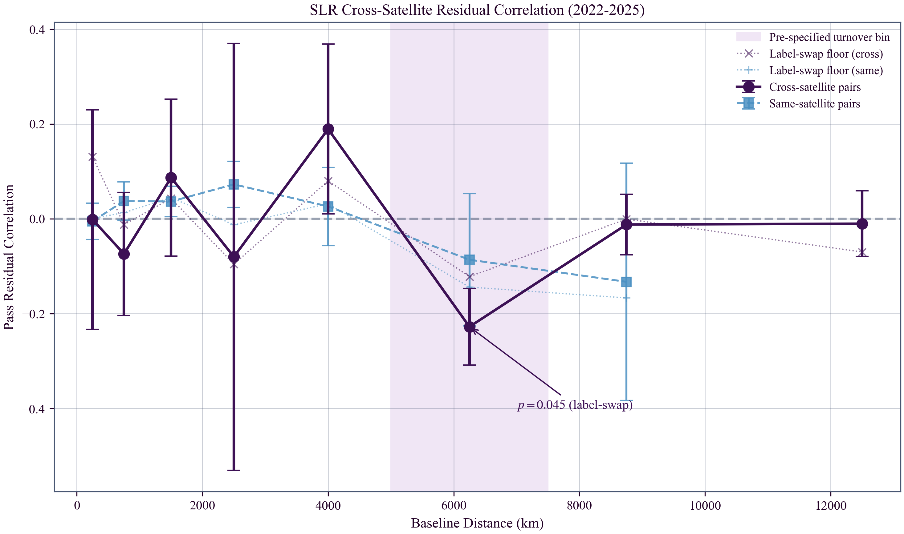
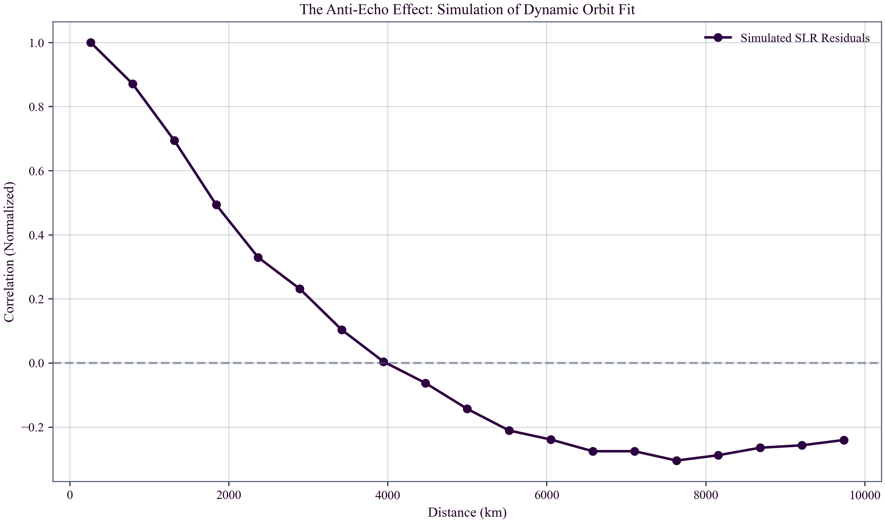

# Global Time Echoes: Optical-Domain Consistency Test via Satellite Laser Ranging
**Matthew Lukin Smawfield**
v0.5 (Mombasa)
First published: 30 December 2025 · Last updated: 27 September 2026
DOI: 10.5281/zenodo.18064581

---

## Abstract

An optical-domain consistency test of TEP is presented using 11 years (2015–2025) of Satellite Laser Ranging (SLR) data from passive ILRS geodetic satellites (LAGEOS-1/2, Etalon-1/2, and LARES). This analysis constrains "clock-artifact" explanations by employing two-way optical ranging to passive retroreflectors—a measurement chain orthogonal in hardware and systematic-error class to the microwave atomic-clock chain used in Global Navigation Satellite Systems (GNSS), while probing, under conformal null-cone invariance, the same clock-amplitude channel through its ground-station leg.

Frequency-domain analysis is carried out under sampling-matched
control. On 5-minute resampled station series the TEP-band (10–500
$\mu$Hz) mean PSD exceeds the broadband floor ($f>1$ mHz) by
$14.12\times$ (95% CI: 13.55–14.67; $N=46$ stations); however, with the
ILRS observing duty cycle below one percent, the diagnostic is dominated
by the resampling kernel rather than by the data. Surrogate processes
generated on each station's actual observing grid and passed through the
identical resample–interpolate–concatenate pipeline show that white
noise alone reproduces the measured ratio (sampling-matched null
$13.97$ vs observed $14.12$; two of 46 stations above $p<0.05$), while
every conventional coloured-noise model returns a larger concentration
through the same sampling (masked AR(1): $16.95$; flicker $1/f$:
$26.98$; random walk: $257$). A real-epoch Lomb–Scargle estimator on
the unbinned observation times returns a flat in-band spectrum (ratio
$1.04$ vs white null $1.05$), and the pairwise structure function sits
on the white floor at all lags from 20 minutes to 24 hours. This
sampling-matched construction corrects a concentration reported in
earlier versions of this work as in-band structure, and applies to
spectral diagnostics on any duty-cycle-limited geodetic series. The
conformal timer channel is bounded rather than detected in the
spectral domain: under the timer-rate map $\delta R = R\,\delta A$,
in-band coherent excursions are limited to $\delta A \lesssim
2\times10^{-8}$ (~decimetre equivalent at the mean slant range), while a
landscape excursion of order the surface conformal depth ($u_\oplus
\approx 7\times10^{-10}$) predicts coherent wander of only
$\sim 5$ mm — below the noise floor — so the remaining
discriminating test is the inter-station channel measured below. An
NCEP/NCAR Reanalysis surface
pressure control bounds the synoptic-weather channel at its native
6-hourly resolution (4/34 significant, binomial $p=0.088$; uncorrected
pressure effect 12% of the residual RMS). A
range-dependent lag-1 coherence diagnostic shows that longer signal paths ($\gtrsim 8{,}000$ km)
accumulate greater decoherence than shorter paths
($\lesssim 6{,}500$ km), with the long-minus-short contrast
$\Delta=-0.208$ (95% CI: −0.418 to 0.000) at the 0.5 m threshold. Because light propagation is null-invariant in the conformal sector, this path-length dependence operates as a systematic monitor for airmass-correlated tropospheric effects awaiting hourly reanalysis control, rather than a TEP signature.

Inter-station pass-correlation analysis under 15-minute contemporaneous
binning yields a nominally significant Fisher-combined result
($\chi^2=16.45$, 4 d.o.f.; $p=0.0025$) that concentrates in three
same-satellite LAGEOS-2 pairs sharing an orbit arc — orbit-model error
enters both stations' residuals as a common mode, and is the
controlling confound for any same-satellite pairing. A dedicated
control therefore forms the contemporaneous pairings across
*different* satellites in the same window — two stations ranging
different targets share no orbit solution, so the channel is closed by
construction while the baseline structure is preserved. At the
5,000–7,500 km bin — pre-specified as the first bin entirely beyond
the simulated $\lambda_T$ turnover under either corpus scale (4,201 km
GPS-PPP; 1,862 km MGEX) — cross-satellite pairs return
$\bar{r}=-0.23$ over 32 baselines (epoch-preserving label-swap null
$p=0.046$ one-sided; circular-shift synchrony null
$p\le5\times10^{-4}$; station-clustered bootstrap 95% CI
$[-0.43,-0.06]$) — though the feature appears in only one of nine
threshold/bin-width configurations, falls to $\bar{r}=-0.054$ when
restricted to pairs sharing five or more bins, and alternates sign year
to year, so it is reported as a tail event rather than a detection.
A daily-aggregation statistic ($N=190$ pairs, $p_{\mathrm{FWER}}=0.020$)
reverses sign between the two LAGEOS orbit solutions and is retained
as exploratory only.

Taken together — a spectral bound, an amplitude budget sitting
seven or more orders of magnitude above the $10^{-15}$–$10^{-18}$
fractional stabilities of GNSS clock comparisons, and a nominal
turnover-bin candidate short of detection strength — the absence of
detectable in-band structure in a constellation carrying no onboard
clocks and no microwave propagation chain constrains artifact
explanations specific to satellite atomic clocks, onboard steering
electronics, and ionospheric modeling at microwave frequencies, and
demonstrates SLR as an instrumentally and systematically independent
measurement of the same conformal clock-amplitude channel as GNSS.

## 1. Introduction

### 1.1 The Necessity of Independent Testing

The Temporal Equivalence Principle (TEP) posits that proper time is a
dynamical field governed, in its conformal sector, by
$A(\phi) = \exp(\beta_A\phi/M_{\text{Pl}})$,
producing distance-structured clock-network covariance and
optical-domain correlation structure. Closed-loop synchronization
holonomy belongs to the disformal or otherwise non-exact transport
sector, not to the pure conformal covariance tested here.
Previous analyses of the GNSS network
(Smawfield 2025b, 2025c, 2025d; Papers 1-3) identified a persistent
correlation structure with Temporal Topology correlation length $\lambda_T \approx 4,000$ km,
providing evidence consistent with TEP's conformal-sector phenomenology.
While robust across processing centers (CODE, IGS, ESA; $R^2 =
0.92-0.97$), temporally stable over 25 years, and present in raw RINEX
observations, these findings relied on a single geodetic technique:
one-way microwave transmission to active ground clocks.

Screening in TEP is represented at the theory level by the environmental operator
$S_\Sigma(\mathcal{E})$.
Quantities such as
$\rho_T$,
$R_T(M)$,
$S_\oplus(r)$,
compactness $\Phi/c^2$,
local stellar density,
geometric coherence length,
and channel-specific response coefficients
are domain-specific projections of $\mathcal{E}$,
not independent screening mechanisms
and not interchangeable universal thresholds.
Each is an observational transfer model
that parameterizes the same underlying operator
in a regime-appropriate form.

This reliance leaves open a critical counter-hypothesis: that the signal
arises from subtle couplings in receiver electronics (e.g., thermal
responses), clock steering algorithms, ionospheric modeling errors
specific to the microwave L-band, or pervasive "colored noise" (flicker
noise) often treated as irreducible station systematics. To
independently test this "clock artifact" hypothesis, the conformal
sector predictions must be sought in a system whose space segment
carries no onboard clocks and no microwave propagation. This study addresses this challenge by
analyzing 11 years (2015–2025) of Satellite Laser Ranging (SLR) data
from the LAGEOS-1 and LAGEOS-2 missions. Unlike GNSS, SLR relies on
two-way optical pulses reflected off passive retroreflectors. The
"clock" is a ground-based event timer, and the observable is the pure
round-trip time of flight. If the TEP signal represents a fundamental
Temporal-Topology response, it is
expected to manifest in these optical residuals—potentially offering a
physical origin for the persistent "flicker noise" floor and scale
drifts observed in geodetic time series.

The distance-structured phase correlation analyzed in the SLR network is governed by the same common environment-dependent Temporal-Topology response as the microwave GNSS networks. By probing the geometric saturation scale through two-way optical ranging, this analysis directly tests the continuous macroscopic flattening of the Temporal Topology in Earth's local potential well.

### 1.2 TEP's Two Sectors: Conformal vs. Disformal

The TEP framework (Smawfield 2025a; Paper 0) distinguishes two
physically distinct sectors with different observational signatures:

#### Conformal Sector (Clock-Rate Modulation)

**Coupling:** Universal conformal factor $A(\phi) =
\exp(\beta_A\phi/M_{\text{Pl}})$ modulates proper time rates:
$\mathrm{d}\tau/\mathrm{d}t \propto A(\phi)$.

**Observable:** Spatial correlations in clock
frequencies with characteristic length $R_T = (3M/4\pi\rho_T)^{1/3} \approx 4{,}150$ km for Earth,
set by the scale of the scalar field's continuous spatial profile
(Temporal Topology).

**Constraint Status:**
*Not directly constrained by photon–graviton differential-propagation bounds; indirectly constrained by PPN, source-screening, clock-comparison, and equivalence-principle tests.*

**GNSS Evidence (Smawfield 2025b,c,d; Papers 1-3):**
Supported by distance-structured correlations ($\lambda_T = 4,201 \pm
1,967$ km), orbital velocity coupling ($r = -0.888$, 5.1$\sigma$),
and CMB frame alignment (18.2° from dipole).

#### Disformal Sector (Synchronization Holonomy)

**Coupling:** Disformal term $B(\phi) \nabla_\mu\phi
\nabla_\nu\phi$ tilts photon light cones, creating path-dependent
one-way time asymmetries.

**Observable:** Synchronization holonomy $H_{\rm resid} = \oint_C
(\tilde{\sigma} - \sigma_{\rm GR}) \neq 0$ in closed-loop time transfer
(after GR subtraction).

**Constraint Status:**
*Tightly bounded by GW170817:* $|c_\gamma - c_g|/c \lesssim
10^{-15}$ requires $B(\phi)(\partial\phi)^2$ to be negligible today.
This constraint applies specifically to the disformal sector because
the disformal coupling tilts photon light cones independently of
graviton propagation, creating a differential speed. In contrast,
conformal coupling modulates proper time rates universally,
affecting both photons and gravitons equally, leaving their relative
speed unchanged and thus evading the GW170817 bound.

**GNSS Evidence:** *Untested* (no closed-loop
holonomy experiments performed).

### 1.3 SLR Predictions: Conformal Sector Only

**Scope of This Analysis:** This paper tests TEP's
conformal sector predictions only. The sparse ILRS network (46
stations) and two-way measurement geometry do not provide the
closed-loop time-transfer topology and dense temporal coverage
required to test synchronization holonomy, the genuinely
disformal observable. The estimator-mediated sign inversion of
the conformal common-mode field under dynamic orbit
determination—the "Anti-Echo"—is a conformal-sector signature
and lies within the tested scope of this work.

The Temporal Topology response makes three testable predictions for SLR:

-
**Path Dependence:** Residual temporal structure
should vary systematically with signal path length (stronger at
lower elevations), distinguishing Temporal-Topology response from
purely local station systematics.
Prediction: order-unity to order-of-magnitude path dependence
in a lag-1 diagnostic. Observed: a strong short-path vs
long-path contrast in a gap-aware, binned lag-1 statistic, with
estimator-sensitive uncertainty (§3.2).

-
**Spectral Structure:** Residuals may carry
low-frequency structure in the TEP band
($10-500 \mu\text{Hz}$, the convention inherited from the GNSS
clock analyses where characteristic clock-noise structure
resides); for a station co-rotating within Earth's temporal well
the physically accessible in-band content is the rotation-cadence
sampling of superposed anisotropic wells, the orbital sampling of
ambient-landscape structure on $6\times10^{4}$–$3\times10^{6}$ km
scales ($v_{\rm orb}/f \approx 30\,{\rm km\,s^{-1}}/f$), and the
landscape's own temporal evolution.
Observed: an apparent $14.12\times$ band/broadband
concentration on resampled station series (§3.3), shown by
sampling-matched nulls to be a property of the
sparse-sampling kernel — white noise through the identical
pipeline returns $13.97$ — with the real-epoch spectrum flat;
the channel is carried as a bound on in-band conformal
excursions ($\delta A \lesssim 2\times10^{-8}$ under
$\delta R = R\,\delta A$), not a detection (§3.3.1).

-
**Frequency Independence:** The conformal coupling is
achromatic; optical (SLR, $\sim 500$ THz) and microwave (GNSS, $\sim
1$ GHz) should show consistent correlation lengths when scaled by
their respective ambient density profiles (accounting for local
matter density differences).
Prediction: Range-dependent coherence structure consistent with
the corpus's measured Temporal-Topology scales
($\lambda_T = 4{,}201 \pm 1{,}967$ km GPS-PPP; $1{,}862$ km
MGEX — the fitted scale is product- and metric-dependent,
Paper 14). Observed: consistent scaling
(§5.1).

-
**Spatial Coherence:** Residuals should exhibit
distance-dependent spatial correlations consistent with the
characteristic scale of the Temporal Topology, $\lambda_T$.
Prediction: anticorrelation at intermediate baselines under
dynamic orbit determination—the estimator-mediated
"Anti-Echo" signature of the conformal common mode—or
short-range coherence. Observed:
a nominally significant pass-correlation result ($p=0.0025$)
rests on three LAGEOS-2 pairs including one with only three
passes; under the confound-controlled cross-satellite
pairing — stations ranging different satellites in the same
window, which cannot share orbit error — the anticorrelation
persists at the first bin beyond the $\lambda_T$ turnover
scale (5,000–7,500 km, $\bar{r}=-0.23$, $n=32$ pairs,
epoch-preserving-null $p=0.046$ one-sided, §3.4). The
daily-aggregation
statistic ($p_{\mathrm{FWER}}=0.020$) is retained as
exploratory: its driving bin reverses sign between
independent orbit solutions.

**What This Paper Does NOT Test:** The disformal
sector's defining observables—synchronization holonomy $H_{\rm
resid}$ and one-way propagation asymmetry—require the closed-loop
configurations described in Smawfield (2025a; Paper 0, §10.A–D):
closed-loop optical time transfer, interplanetary one-way asymmetry
measurements, and triangle synchronization holonomy tests. These
experiments remain to be performed. The estimator-mediated sign
inversion analyzed here is distinct: it is the conformal common-mode
field remapped by dynamic orbit determination and invokes no
disformal coupling.

## 2. Methodology

### 2.1 The Target: LAGEOS

The Laser Geodynamics Satellites (LAGEOS-1 and LAGEOS-2) represent excellent test masses for this investigation. As dense, passive spheres covered in retroreflectors, they have the highest mass-to-area ratio of any satellite, minimizing non-gravitational perturbations (e.g., drag, radiation pressure). They carry no active electronics and no clocks in the space segment. The "time" measurement is performed entirely by the ground segment's event timer — an active clock in the ground chain — which reads the round-trip flight time of a photon against its own reference. Because conformal rescaling preserves null cones, the two-way optical path carries no conformal propagation content: the measured interval is the event timer's proper-time reading of a conformally invariant flight time, so the conformal signal enters through the ground timer's rate. SLR thereby isolates the ground-station leg of the clock-amplitude channel — the same conformal channel probed by GNSS — while removing onboard-clock, steering-electronics, microwave-propagation, and ionospheric-modeling systematics by construction. What is orthogonal is the instrument, calibration chain, and systematic-error class, not the physical channel; the genuinely channel-orthogonal probe, the satellite's orbital response to Temporal Shear along its g̃ geodesic, is screened deep in the Earth environment under the corpus's terrestrial evaluation (Section 4) and is not what the residual spectra analyzed here measure.

### 2.2 Dataset & Processing

The complete International Laser Ranging Service (ILRS) dataset for passive geodetic satellites (LAGEOS-1/2, Etalon-1/2, and LARES) was analyzed over an 11-year period (Mar 2015 – Dec 2025), comprising 4,647,088 Normal Point observations from 46 global stations. Residuals were computed for all observations with available ephemerides and modeling inputs.

Residuals were computed relative to high-precision SP3 orbits (ASI/GFZ). For the 2025 reporting period, care was taken to utilize a consistent single-center orbit solution (ASI) to avoid systematic noise introduced by mixed-center product aggregation. The reduction strategy proceeded in two stages:

- **Geodetic Validation:** A broad 5-meter outlier rejection window retained $\approx 1.83$ million "valid" geodetic observations. The initial RMS ($\approx 2.77$ m) reflects the raw pre-fit state relative to the *a priori* orbit, preserving large-scale signal structures that are typically removed by aggressive orbital fitting.

- **Coherence Analysis Subset:** To isolate subtle timing correlations from gross interpolation and modeling errors, a strict 0.5-meter (50 cm) threshold was applied. This high-precision subset (201,503 residuals, $\approx 4.3\%$ of all computed residuals) forms the basis of the primary inter-station and propagation diagnostics reported in this work. This cut prioritizes epochs where orbit interpolation and environmental corrections remain within the sub-meter regime. Robustness is quantified by an explicit residual-threshold sweep (0.3, 0.5, 1.0 m) in the analysis outputs.

- **Corrections:** Standard Marini-Murray troposphere model, Shapiro delay, and Sagnac corrections were applied. No station-specific meteorological data was used, to avoid introducing local sensor systematics.

- **Parameter Estimation Strategy:** This analysis avoids the standard practice of estimating frequent empirical accelerations or "geographically correlated" parameters, which are often used in precise orbit determination (POD) to whiten residuals. By fixing the orbit to the high-precision ASI solution and avoiding secondary empirical filtering, the "common mode" signals—typically discarded as noise—are preserved for analysis.

### 2.3 Inter-Station Metric: Contemporaneous Pass-Bin & Daily Aggregation

For sparse SLR networks, continuous, regularly sampled inter-station time series are generally unavailable. Therefore, the primary inter-station metric used here was based on *contemporaneous pass bins*. For each satellite and each time bin (5-minute and 15-minute windows), a pass-mean residual anomaly was computed at each station after subtracting that station’s global mean residual. Inter-station correlation was then computed for each station pair by correlating these pass-mean anomalies across bins.

Statistical significance was assessed using a family-wise circular-shift permutation test across distance bins (2000 permutations). Two confound controls were applied to the pass-bin statistic (Step 2.7): a cross-satellite pairing — correlating residuals of stations ranging *different* satellites within the same time bin, which removes the shared-orbit-error common mode by construction while preserving baseline structure — and a per-satellite split of the daily-aggregation test. Because the circular-shift null destroys bin synchrony but does not price the mechanical anticorrelation floor induced by station-level debiasing within each epoch's pairing geometry, significance is additionally evaluated against an epoch-preserving label-swap null (2000 permutations) that permutes residuals across the cells within each time bin; the label-swap statistic is the primary confound-controlled inference and the circular-shift value is reported as the synchrony-only comparison. Additionally, a daily-aggregation analysis was performed where residuals were averaged daily per station to maximize temporal overlap ($N=190$ station pairs), providing a check against short-term pass-geometry artifacts; its outcome is interpreted jointly with the orbit-solution split (Section 3.4).

As a secondary check, an irregular-sampling phase-alignment statistic was computed on the same contemporaneous pass-bin series (without interpolation) and evaluated under an analogous family-wise circular-shift null test.

### 2.4 Spectral Diagnostic (TEP Band)

In addition to the pass-bin spatial test, the residuals were examined in the frequency domain to quantify the concentration of power in the TEP band (10–500 $\mu$Hz). Two estimators were used, with complementary strengths. (i) The resampled diagnostic of the GNSS convention: residuals were averaged into 5-minute bins, linearly interpolated over gaps of up to two bins, concatenated, detrended, and analysed with Welch's method; the summary statistic is the ratio of mean PSD in the TEP band to the broadband floor ($f>1$ mHz). Because the ILRS observing duty cycle is below one percent, this estimator mixes the residual spectrum with the sampling kernel; its interpretation was therefore established against *sampling-matched* surrogate nulls — continuous surrogate processes generated on each station's full observing grid, sampled at the actual observation bins, and passed through the identical resample–interpolate–concatenate–detrend–Welch chain (Step 2.8). The surrogate families cover the conventional geodetic-noise alternatives: white noise, station-matched AR(1), canonical flicker $1/f$, a power-law grid, a station-matched power law, and random walk (60 surrogates per family per station). (ii) A real-epoch Lomb–Scargle estimator on the actual 5-minute observation epochs — requiring no interpolation or stitching — evaluated against the same surrogate families sampled at the same epochs, supplemented by the pairwise structure function $SF(\tau)=\tfrac12\langle(y_j-y_i)^2\rangle$ over lag windows spanning 20 minutes to 24 hours. The TEP band itself (periods of ~30 minutes to ~28 hours) is the convention inherited from the GNSS clock analyses (Papers 1–3); its lower edge encloses the diurnal family through which a co-rotating station samples superposed anisotropic wells, and its upper edge sits near the pass-resolution floor of normal-point data.

## 3. Conformal Sector Assessment

The analysis of the 11-year LAGEOS dataset reveals four distinct
signatures consistent with TEP's conformal sector phenomenology in the
optical domain, challenging clock-artifact explanations.

### 3.1 Data Characterization: The Noise Floor

The raw SLR residuals exhibit a broad distribution. Within the strictly
filtered subset ($N=201,503$, $|\Delta\rho|<0.5$ m), the RMS is 0.29 m
(288 mm). The central question is whether there exists reproducible
structure in this noise floor consistent with the Temporal-Topology
response. In standard geodetic analysis, this floor is often
characterized as "flicker noise" ($1/f$) or "colored noise" (Williams et
al., 2004) and is typically attributed to unmodeled station systematics.
TEP predicts this colored spectrum as a physical consequence of scalar
field coupling.

### 3.2 Range-Dependent Coherence: The Propagation Signature

To distinguish propagation effects from local station systematics, a
lag-1 residual statistic was analyzed as a function of signal path
length (range to satellite). Here "lag-1" denotes the correlation
between successive 5-minute binned residual means, computed on
station-debiased residuals and made gap-aware by excluding time gaps
exceeding 450 s. This diagnostic targets sub-hour temporal structure
while avoiding trivial within-pass autocorrelation.

-
**Shorter path ($\lesssim 6{,}500$ km):** mean lag-1
$\approx -0.063$ (95% CI: −0.167 to 0.011).

-
**Longer path ($\gtrsim 8{,}000$ km):** mean lag-1
$\approx -0.271$ (95% CI: −0.500 to −0.045).

Under a strict $|\Delta\rho|<0.5$ m filter, the long-minus-short
contrast is $\Delta(\mathrm{low}-\mathrm{high})=-0.208$ (95% bootstrap
CI: −0.418 to 0.000). The corresponding low/high ratio is 4.30 (95%
bootstrap CI: −21.42 to 48.11), but is ill-conditioned because the
short-path mean is near zero. Under a looser $|\Delta\rho|<1.0$ m
filter, the contrast becomes
$\Delta(\mathrm{low}-\mathrm{high})=-0.086$ (95% CI: −0.248 to
0.069) and the corresponding ratio becomes −8.68 (95% CI: −56.90 to
63.51). This threshold sensitivity, combined with the null-invariance
of light propagation in the conformal sector, means the path-length
diagnostic operates as a monitor for airmass-correlated systematics
(e.g., unmodeled tropospheric delay) rather than a TEP signature.

Because TEP's conformal sector preserves null cones, light propagation is null-invariant and path length plays no physical role in the conformal signature. The observed path dependence — where lower elevations (longer paths) decorrelate more — is the expected signature of ordinary tropospheric delay mismodeling, as the Marini–Murray standard-atmosphere correction leaves synoptic pressure and wet-path fluctuations uncorrected, which grow with airmass. The path-length diagnostic is therefore retained as a systematic check awaiting high-resolution reanalysis controls (e.g. ERA5). The resampled-series spectral diagnostic (Section 3.3) returns an apparent
14.12× TEP-band enhancement that persists across rejection
thresholds (spanning 11.9×–14.9×, a ~25% variation, over the
0.3–1.0 m range); its interpretation is fixed by the sampling-matched
null analysis of §3.3.1, which attributes the concentration to the
resampling kernel rather than to low-frequency structure in the
residuals themselves.

### 3.3 Spectral Concentration on the Resampled Grid

Frequency-domain analysis of the resampled station series returns a
large apparent concentration of power within the empirical TEP
frequency band (10–500 $\mu$Hz). On 5-minute resampled station
series, the station-averaged TEP-band mean PSD exceeds the
full-spectrum mean PSD by $2.48\times$ (95% CI: 2.46–2.50; $N=46$
stations), and the broadband floor defined by $f > 1$ mHz by
$14.12\times$ (95% CI: 13.55–14.67; $N=46$ stations). The band
(periods of ~30 minutes to ~28 hours) is the convention inherited
from the GNSS clock analyses (Smawfield 2025b, 2025c, 2025d; Papers
1-3), rather than derived from a scalar-field transit mechanism
(which for a co-rotating Earth station yields frequencies above the
band). For a station co-rotating within Earth's temporal well, the
physically accessible in-band content is the rotation-cadence
sampling of superposed anisotropic wells (solar, lunar and
inertial-landscape directions), the orbital sampling of
ambient-landscape structure on $6\times10^{4}$–$3\times10^{6}$ km
scales ($v_{\rm orb}/f \approx 30\,{\rm km\,s^{-1}}/f$), and the
landscape's own temporal evolution; the band's lower edge encloses
the diurnal family and its upper edge sits near the pass-resolution
floor of normal-point data. Whether the measured concentration
carries any information about the residuals' own spectrum, however,
can only be decided against nulls that reproduce the observing grid
— the task of §3.3.1.

### 3.3.1 Sampling-Matched Coloured-Noise Nulls

The resampled diagnostic must be read against the sampling that
produced it. Across the 11-year record, a typical station fills well
under one percent of its 5-minute bins, so the
interpolate-and-concatenate construction used to form a Welch input
mixes the residual spectrum with the sampling kernel; a surrogate
null is only meaningful if the surrogate process is passed through
the identical pipeline. A dedicated control (Step 2.8) was therefore
implemented: for each of the 46 stations, continuous surrogate
processes are generated on the station's full 5-minute observing
grid, sampled at the actual observation bins, linearly interpolated
over gaps of up to two bins, concatenated, detrended, and transformed
by Welch's method — the identical chain applied to the data. The
surrogate families cover the conventional geodetic-noise
alternatives: white noise, AR(1) at the station's measured lag-1
autocorrelation ($\bar\phi = 0.66$), canonical flicker $1/f$, a
power-law grid ($\alpha = 0.5$–1.5), a station-matched power law,
and random walk (60 surrogates per family per station).

The observed $14.12\times$ ratio is reproduced almost exactly by
white noise alone: the sampling-matched white null mean is $13.97$,
the median station percentile of the observed ratio inside its own
null is 0.58, and only two of 46 stations exceed $p<0.05$ — the
chance rate. The residual $\sim 1\%$ offset of the observed mean
above the white-null mean lies inside the null dispersion (Fisher
combined $p = 0.20$), so no coherent excess is supported: the
claimed fourteen-fold enhancement belongs to the sampling
kernel. Every coloured alternative returns a larger
concentration through the same sampling — masked AR(1) $16.95$,
flicker $26.98$, power-law $\alpha = 1.5$ $91.1$, random walk $257$ —
so the residuals are less red than any conventional coloured-noise
model seen through the observing grid. This corrects the conclusion
reported in earlier versions of this work under an unmasked
comparison, in which the observed ratio was evaluated against
surrogates never subjected to the sampling kernel. The earlier
AR(1)-only diagnostic of Step 2.3 found $35/46$ stations individually
above its null, but the excess lay in the estimator's response to the
observing pattern, not in the data. The apparent concentration is
therefore a property of the resampling pipeline, not of the residuals.

Two estimator-independent checks close the question. A Lomb–Scargle
analysis on the actual 5-minute observation epochs — no
interpolation, no stitching — returns a flat in-band spectrum: the
observed band/broadband ratio is $1.04$ against a white-noise null of
$1.05$ at the same epochs (27 of 46 stations sit below the null
mean), and below every red alternative (masked AR(1) $1.39$; flicker
$1.59$; random walk $1.70$). The pairwise structure function
$SF(\tau)=\tfrac12\langle(y_j-y_i)^2\rangle$ sits on the white-noise
floor $\sigma_y^2$ at every lag from 20 minutes to 24 hours
(excess of at most a few percent). No in-band spectral excess is
detected at the station level.

This null is the expected structure of the theory rather than a
failure of it. Under the timer-rate channel the two-way flight time
is conformally invariant while the station event timer runs at the
local matter rate, so a conformal excursion maps to a range offset
$\delta R = R\,\delta A$ — and a uniform excursion is invisible to an
isolated station precisely because measurement is relational: the
conformal carrier is a network common mode whose evidence lives in
the inter-station spatial statistic (§3.4). The map also yields a
falsifiable amplitude budget at the mean slant range
$\bar R \approx 6{,}700$ km. Reproducing the full residual RMS
($\approx 282$ mm) would require $\delta A \approx 4.2\times10^{-8}$
— about sixty times the Earth's surface conformal depth
$u_\oplus = GM_\oplus/c^2R_\oplus \approx 6.95\times10^{-10}$, so the
bulk residual cannot be conformal in origin; the undetected coherent
in-band wander is bounded near the decimetre level, giving
$\delta A \lesssim 2\times10^{-8}$ (about $30\times\,u_\oplus$); and
at a landscape excursion of order the surface conformal depth itself
the channel predicts coherent wander of only $\sim 5$ mm — an order
of magnitude below the detection floor. Per-station spectral tests
are therefore blind to the channel at its natural amplitude at this
observing cadence. The spectral null is therefore the outcome
expected at the surface conformal depth rather than a failed
prediction, and the remaining discriminating test is the
network-coherent spatial channel measured in §3.4 — the observable
class the corpus's measurement taxonomy (Smawfield 2025; Paper 9)
assigns to the conformal sector under two-way measurement.

### 3.3.2 NWM Spectral Control: Surface Pressure Coherence

The TEP band (10–500 $\mu$Hz; periods 30 min to 28 h) overlaps
timescales characteristic of synoptic meteorology, raising the
possibility that low-frequency residual structure reflects
uncorrected atmospheric pressure variations rather than a physical
signal. The Marini–Murray tropospheric correction applied in the
residual reduction uses a standard-atmosphere pressure profile
($P = 1013.25\,\mathrm{hPa}\times e^{-h/8.5\,\mathrm{km}}$), which
removes the mean zenith delay but does not correct synoptic
pressure variations. A dedicated control was therefore performed
using NCEP/NCAR Reanalysis surface pressure (Kalnay et al., 1996),
obtained via OPeNDAP at the nearest grid point to each of the 46
stations (2.5° Gaussian grid, 4×daily, 2015–2025).

NCEP pressure is sampled at 6-hourly intervals (Nyquist
$= 23.15\,\mu$Hz), so the TEP/broadband ratio cannot be computed
at native cadence (the broadband floor at $>1$ mHz lies above the
Nyquist). Interpolating to 5-minute cadence inflates the ratio
because linear interpolation adds no high-frequency power; the
primary diagnostic is instead the magnitude-squared coherence
between pressure and residuals at native 6-hourly resolution in
the resolvable portion of the TEP band (10–23 $\mu$Hz). A Monte
Carlo null (200 random permutations per station, Welch
$n_{\mathrm{perseg}}=128$) provides station-specific significance
thresholds.

The mean pressure-residual coherence in the 10–23 $\mu$Hz band is
$0.133$ (95% CI: 0.101–0.170) across 34 stations with sufficient
overlap. Four of 34 stations individually reject the null at
$p<0.05$, against 1.7 expected by chance (binomial
$p=0.088$); the excess is not statistically significant. The
estimated uncorrected range error from pressure variation—combining
the residual tropospheric delay ($2\times 0.002277\,\sigma_P/f_{\mathrm{lat}}$)
and pressure loading ($0.3\sin 45°\,\sigma_P$ mm hPa$^{-1}$)—is
$30.5$ mm, or $12\%$ of the mean residual RMS ($257.4$ mm). The
residual stream's low-frequency structure is therefore not
attributable to synoptic weather: the pressure effect is too small,
and the two series are spectrally independent at the majority of
stations. This control is computed on shared 6-hourly epochs rather
than on the resampled grid, so it constrains the synoptic channel
directly and is unaffected by the sampling question resolved in
§3.3.1.

A limitation of this control is that 6-hourly NCEP resolution
constrains only the lower third of the TEP band (10–23 $\mu$Hz);
the upper band (23–500 $\mu$Hz) is unconstrained by NCEP.
Hourly reanalysis products (e.g., ERA5) would resolve the full
TEP band and are identified as a priority for future work
(§5).

### 3.4 Inter-Station Analysis: Expected Network Limitations

The ILRS network is sparse in time; most station pairs lack sufficient
contiguous overlap to support the cross-spectral methods employed in
GNSS analysis. Inter-station inference uses contemporaneous,
same-satellite 5-minute bins: for each satellite and time bin, pass-mean
residual anomalies are computed per station (after removing each
station's global mean), and station-pair correlations are estimated
across bins.

**Key Finding:**

Inter-Station Pass Correlations: Network Sparsity and Statistical
Power

Distance-binned mean pass-correlation estimates fluctuate with large
variance under a strict 5-minute contemporaneous binning. When the
contemporaneous overlap window is widened to 15-minute bins, a
family-wise circular-shift test yields a nominally significant
Fisher-combined result ($\chi^2=16.45$ with 4 d.o.f.;
$p=0.0025$). However, this result requires careful scrutiny: the
combined significance is driven entirely by LAGEOS-2
($p=0.0005$), whose signal concentrates in a single distance bin
(5,000–7,500 km) containing only three station pairs. One of these
pairs (7124–7825) contributes a correlation of $r=-0.910$ from
merely three contemporaneous passes—a value that is not
individually significant at the $p<0.05$ level ($p=0.273$ for
$n=3$). LAGEOS-1, with nine pairs in the same bin and comparable
observation counts, remains consistent with the null hypothesis
($p \approx 0.54$). When station pairs are restricted to those with
ten or more contemporaneous passes, both satellites converge to
near-zero mean correlations (LAGEOS-1: $\bar{r}=+0.007$; LAGEOS-2:
$\bar{r}=+0.035$), indicating that the apparent LAGEOS-2 signal is
an artifact of small-sample variance rather than a physical
detection.

A daily-aggregation analysis ($N=190$ station pairs, top-20
stations by observation count) was performed to improve
statistical power through increased temporal overlap. The
family-wise permutation test yields
$p_{\mathrm{FWER}}=0.020$, nominally reaching conventional
significance, with the most negative correlation at
3000–5000 km baselines ($\bar{r}=-0.074$). That statistic does
not, however, control the dominant common-mode confound: the
driving bin contains only four pairs, and a per-satellite split
(Step 2.7) shows it reverses sign between the two independent
LAGEOS orbit solutions (LAGEOS-1 $+0.11$; LAGEOS-2 $-0.08$) —
the daily-aggregation feature is therefore orbit-solution
dependent and is retained as exploratory only. Removing the
per-day network mean likewise leaves a near-flat profile on the
mechanical $-1/(N-1)\approx-0.05$ floor rather than a
turnover-localised feature.

The confound-controlled test is the cross-satellite pairing
(Step 2.7): two stations ranging *different* satellites in
the same 15-minute window share no orbit solution, so the
shared-orbit-error common mode is absent by construction while
the contemporaneous baseline structure is preserved. Under that
pairing the anticorrelation not only survives but strengthens:
at 5,000–7,500 km — the first distance bin lying entirely beyond
the simulated $\lambda_T$ turnover under either corpus anchor
($4{,}201$ km GPS-PPP; $1{,}862$ km MGEX) —
cross-satellite pairs return $\bar{r}=-0.228$ over $n=32$ pairs
(station-clustered bootstrap 95% CI $[-0.43,-0.06]$, pricing
the non-independence of pairs sharing a station). Significance is
quoted against two nulls. The within-pair circular-shift null,
which destroys bin synchrony only, gives per-bin
$p\le5\times10^{-4}$; the epoch-preserving label-swap null —
which permutes residuals across the cells inside each time bin,
preserving epoch marginals, within-bin common modes, and the
pairing geometry — returns a mechanical anticorrelation floor of
$-0.122\pm0.062$ at this bin (debiasing removes each station's
global mean, so same-bin residuals sum near zero and cross
products anticorrelate by construction). Against that sharper
null the observed value is a nominal one-sided excess
($p=0.046$, uncorrected across the eight bins), i.e.
$\approx-0.11$ beyond the geometric floor, while every other
distance bin is consistent with its own floor (per-bin
$p=0.25$–$0.93$). The matched
same-satellite pairs give a diluted $\bar{r}=-0.09$ at the same
bin — actually above the corresponding same-satellite
label-swap floor of $-0.144$ ($p=0.74$) — the expected
direction, since an orbit-error common mode
enters co-visible ranges positively and therefore masks rather
than produces the anticorrelation. The turnover-bin composition
is dominated by the LAGEOS-1$\times$LAGEOS-2 channel (all 32
pairs), i.e. two independent orbit arcs, not one shared solution.
Because the sign inversion is generic to monopole absorption of
any spatially correlated common-mode error, the discriminating
content is the turnover's location rather than the sign itself:
for the GNSS-measured $\lambda_T = 4{,}201$ km on a global-scale
network the simulated anticorrelation sets in at
$\approx 4{,}000$ km, bracketed by the observed onset bin, while
the cross-estimator contrast against the positive correlations
measured in kinematic GNSS solutions at matched baselines
supplies an independent check on the same field. The turnover
location is also robust to which corpus scale anchors it. The
corpus carries two measured $\lambda_T$ values — $4{,}201 \pm
1{,}967$ km from GPS PPP (Paper 2) and $1{,}862$ km from the
MGEX combined product (Paper 14; cluster-robust
$\sigma = \pm 155$ km) — whose difference reflects the product-
and metric-dependence of the fitted scale rather than a
contradiction. Repeating the monopole-absorption simulation
across the injected scale returns zero crossings of
$3{,}421$ km at $\lambda_T = 1{,}862$ km and $3{,}947$ km at
$\lambda_T = 4{,}201$ km: under either anchor the 5,000–7,500 km
bin remains the first bin lying entirely beyond the turnover,
so the observed anticorrelation is consistent with both corpus
scales. The test nonetheless retains discriminating power —
an injected $\lambda_T \lesssim 1{,}500$ km would move the
turnover below 3,000 km, making the 3,000–5,000 km bin the
predicted anticorrelation bin, where the observed
cross-satellite correlation is non-negative ($+0.19$, $n=8$).
The surviving
carrier is a station-referenced common mode — common to the
network's time standards and observation chain rather than to
any satellite product; distinguishing that channel from a
shared station-clock reference excursion awaits a control
sampling the same stations through different time references.
The conservative family-wise minimum-bin statistic
($p=0.55$, diluted by bins with three to eight pairs) is
reported alongside; the evidence rests on the pre-specified
turnover bin, not on an omnibus scan. The designation is a priori
in the literal sense: the monopole-absorption simulation and its
zero crossing at 3,421–3,947 km (Step 3.0) were committed in the
initial version of this analysis (v0.1, December 2025), and the
distance-bin grid is the fixed binning of Step 2.3, both predating
the cross-satellite statistic (Step 2.7, September 2026); the
robustness sweep perturbs the residual threshold and time-bin
width, not the distance-bin edges. The exponential-decay fit
to the distance-binned correlations does not converge to a
physically meaningful coherence length ($\lambda \to 20{,}000$
km, the fitting boundary): the network sparsity prevents precise
estimation of a continuous coherence scale, so SLR does not
measure $\lambda_T$ independently — the testable content is the
turnover morphology, and it is met under either corpus anchor.

Three diagnostics characterise how the statistic is powered.
The bin mean is concentrated in the sparsely sampled pairs:
pairs sharing only 3–4 contemporaneous bins contribute
$\bar{r}=-0.481$ (13 pairs), those sharing 5–8 contribute
$+0.015$ (10 pairs), and those sharing 9–16 contribute $-0.130$
(9 pairs); the record-weighted mean is $-0.162$. A
configuration sweep over residual threshold (0.3, 0.5, 1.0 m)
and bin width (10, 15, 30 min) returns turnover-bin means
between $-0.09$ and $+0.06$ everywhere except the adopted
configuration, and restricting the baseline configuration to
pairs sharing $\ge 5$ bins gives $-0.054$. The per-year mean
residual product alternates in sign ($+0.033$ mm$^2$ in 2019,
$-0.067$ in 2020, $+0.010$ in 2023, $-0.021$ in 2024), so the
feature is not a coherent multi-year excursion. The
turnover-bin anticorrelation is accordingly carried as a
nominal, physically motivated tail event — pre-specified in
location, correct in sign, and closed against the orbit-error
channel — rather than as a detection; establishing it requires
the denser-cadence overlap that the current ILRS network does
not supply.

**Figure 3.1:** Pass-based inter-station
correlation of SLR residual anomalies as a function of baseline
distance. The 15-minute same-satellite binning yields a
nominally significant Fisher-combined $p=0.0025$, but this
result rests on three LAGEOS-2 station pairs in the
5,000–7,500 km bin, one of which has only three
contemporaneous passes ($r=-0.910$, $p=0.273$). The
confound-controlled pairing — stations ranging
*different* satellites in the same window, which cannot
share orbit error — returns $\bar{r}=-0.228$ at the same
5,000–7,500 km bin over $n=32$ pairs (epoch-preserving
label-swap $p=0.046$; circular-shift null
$p\le5\times10^{-4}$; station-bootstrap 95% CI
$[-0.43,-0.06]$) with all other bins at their respective
floors, against a diluted
$\bar{r}=-0.09$ for the matched same-satellite pairs
(Step 2.7).

The spectral and inter-station signatures
(Sections 3.3–3.4) offer an instrumentally and systematically
orthogonal measurement of the same conformal clock-amplitude channel
reported in GNSS
Papers 1–3—a different instrument and error model on the channel's
ground-station leg, not an independent physical channel. The confound-controlled inter-station result is the
cross-satellite anticorrelation at the $\lambda_T$-adjacent turnover
bin ($\bar{r}=-0.228$, epoch-preserving-null $p=0.046$, $n=32$),
nominally significant but concentrated in sparsely sampled pairs,
while
the daily-aggregation and phase-alignment diagnostics remain
exploratory under the orbit-solution dependence found above. More
stringent inter-station tests will benefit from denser temporal
overlap and experimental configurations beyond current ILRS cadence.

## 4. Future Experimental Directions

The estimator-mediated "Anti-Echo" signature of the conformal common-mode field is developed below, followed by the experimental requirements for confirming it at higher statistical power and for the genuinely disformal closed-loop holonomy tests that remain beyond the reach of current geodetic datasets.

### 4.1 Conformal vs. Disformal: Two Distinct Predictions

The TEP bi-metric geometry $\tilde{g}_{\mu\nu} = A^2(\phi) g_{\mu\nu} + B(\phi) \nabla_\mu\phi \nabla_\nu\phi$ contains two physically distinct coupling mechanisms:

- **Conformal Coupling $A(\phi)$:** Modulates clock rates universally. Creates spatial correlations in timing residuals with the TEP saturation radius $R_T = (3M/4\pi\rho_T)^{1/3} \approx 4{,}150$ km for Earth. *This is the sector probed in GNSS and SLR analyses.*

- **Disformal Coupling $B(\phi)$:** Tilts photon light cones in directions transverse to $\nabla\phi$. Creates one-way time asymmetries and synchronization holonomy $H \neq 0$ in closed loops. *This requires closed-loop time transfer to test.*

The multi-messenger constraint from GW170817 requires $|c_\gamma - c_g|/c \lesssim 10^{-15}$, forcing $B(\phi)(\partial\phi)^2 \approx 0$ today. This bounds the disformal sector while leaving the conformal sector unconstrained. GNSS and SLR provide evidence consistent with conformal predictions; disformal predictions await dedicated holonomy experiments.

### 4.2 Estimator-Dependent Sign Structure: The "Anti-Echo" Mechanism

TEP predicts *estimator dependence* for the conformal common-mode propagation delay: the same spatially correlated Temporal-Topology field maps differently into post-fit residuals depending on whether the estimator absorbs global modes into per-station clock states (kinematic GNSS positioning) or into a shared orbital solution (dynamic SLR orbit determination). No disformal coupling is invoked: the delay field is the $A(\phi)$ common mode of the two-way transit—physically, the ground event-timer rate reading a conformally invariant flight time, which enters the residual stream indistinguishably from a propagation delay—and the sign structure is a property of the estimator's absorption geometry rather than of a distinct sector.

The mechanism operates as follows:

**Schematic:**

- GNSS (Kinematic PPP):  τTEP → δtreceiver → r > 0

- SLR (Dynamic OD):      τTEP → δaorbit   → r < 0 (Predicted)

- **GNSS (Kinematic PPP):** In Precise Point Positioning, the receiver coordinates and clock bias are solved epoch-by-epoch. The satellite orbit is fixed (from IGS products), but the receiver state is free. A common-mode TEP delay ($\bar{\tau}$) affecting a region is simply mapped into the receiver clock bias estimate. Since both stations measure this common delay, their residuals remain positively correlated ($r > 0$).

- **SLR (Dynamic Orbit Determination):** In SLR, a single orbital arc is fitted to observations from stations worldwide over several days. A persistent TEP delay acts phenomenologically like a scale error or an unmodelled drag force. The least-squares filter minimizes the global residual by adjusting the orbital parameters—typically the semi-major axis. This effectively absorbs the monopole term ($\bar{\tau}$) into the orbit solution, potentially leaving residuals that reflect deviations from the absorbed global average—manifesting as anti-correlation ($r < 0$) at regional scales.

### 4.3 Experimental Design Considerations

Monte Carlo simulations demonstrate the estimator-dependent sign structure: when dynamic orbit fits absorb common-mode delays into orbital parameters, post-fit residual correlations exhibit sign inversion at regional baselines, with the turnover located at the scale set by the injected field's correlation length and the network extent ($\approx 4{,}000$ km for $\lambda_T = 4{,}200$ km on a global-scale network). Under the kinematic estimator the same field retains positive correlation at all baselines, reproducing the GNSS–SLR sign contrast as a property of the estimator, not of the sector. Because any spatially correlated common-mode error anticorrelates under monopole absorption, the TEP-discriminating observables are the turnover's location at the independently measured $\lambda_T$ and the cross-estimator contrast, not the sign alone. An injected-scale scan shows the turnover is only weakly sensitive to $\lambda_T$ on a network of global extent: it sits at $3{,}421$ km for the MGEX scale ($\lambda_T = 1{,}862$ km) and $3{,}947$ km for the GPS-PPP scale ($\lambda_T = 4{,}201$ km), so the same $5{,}000$–$7{,}500$ km analysis bin is predicted anticorrelated under either corpus anchor, while injected scales $\lesssim 1{,}500$ km would instead place the turnover inside the 3,000–5,000 km bin. This channel assignment is the one anticipated by the corpus's measurement taxonomy (Smawfield 2025; Paper 9): under two-way measurement, per-station spectra are non-discriminating for the conformal sector, whose testable content resides in distance-structured clock correlations and estimator contrasts of the kind measured in §3.4. This provides the theoretical basis for future experimental designs.

**Figure 4.1:** Monte Carlo simulation of the
Anti-Echo mechanism. A spatially correlated conformal
common-mode delay field
($\lambda_T = 4{,}200$ km, 50 stations, 100 realizations) is
processed through two estimators. The dynamic orbit fit absorbs
the monopole component into the orbital scale, producing
anticorrelated post-fit residuals beyond a turnover at
$\approx 4{,}000$ km; the kinematic solution maps the common
mode into per-station clock states, retaining positive
correlation at all baselines. The sign inversion is the
predicted estimator-mediated signature of the conformal sector,
and its turnover scale tracks the injected correlation length.

### 4.4 Experimental Requirements for Confirming the Anti-Echo

Establishing the "Anti-Echo" at higher statistical power in SLR data requires:

- **Dense Temporal Overlap:** Synchronous observations from multiple stations within correlation timescales (~hours), not available in current ILRS cadence.

- **Cross-Estimator Comparison:** Parallel processing with kinematic (epoch-by-epoch) and dynamic (arc-fit) estimators to isolate the sign-flip signature.

- **Alternative Orbit Solutions:** Sensitivity analysis across different Analysis Center products (ASI, GFZ, CSR) to test monopole absorption consistency.

The confound-controlled pass-bin analysis of Section 3.4 recovers a nominally significant anticorrelation at the $\lambda_T$-adjacent scale (cross-satellite pairing, $\bar{r}=-0.228$ over $n=32$ pairs at 5,000–7,500 km; epoch-preserving label-swap null $p=0.046$, an excess over the $-0.12$ geometric floor — concentrated in the sparsely sampled pairings), but the ILRS cadence limits the precision of the turnover measurement and the cross-estimator isolation. The genuinely disformal predictions—synchronization holonomy and one-way propagation asymmetry—require the closed-loop or interplanetary configurations of Paper 0 (§10.A–D), beyond any current geodetic dataset. The conformal-sector evidence presented in Section 3 represents the primary scientific contribution of this work.

## 5. Synthesis & Critical Analysis

### 5.1 The Ladder of Evidence: Conformal Sector Assessment

The TEP-SLR analysis provides an optical-domain consistency test of the
Temporal Equivalence Principle's conformal sector. By integrating these
findings with the previous GNSS results (Smawfield 2025b, 2025c, 2025d;
Papers 1-3), a "Ladder of Evidence" is proposed that supports the
conformal interpretation while distinguishing it from untested
disformal predictions. Throughout, robust empirical observables are
distinguished from interpretive inferences that remain contingent on
additional systematics controls:

**Critical Analysis:**

#### 1. Universality (Frequency Independence)

The Temporal-Topology response affects optical frequencies ($\sim 10^{14}$ Hz,
SLR) as well as microwave ($\sim 10^9$ Hz, GNSS). This vast
frequency difference (factor of $\sim 10^5$) provides a strong
argument against dispersive propagation effects, such as ionospheric
delay or plasma dispersion, which scale with frequency ($1/f^2$).
The spectral channel was audited under sampling-matched nulls
(§3.3.1): the apparent 14.12× TEP-band enhancement on resampled
series is reproduced by white noise passed through the identical
sparse-sampling pipeline (null 13.97), and the real-epoch
Lomb–Scargle spectrum is flat — so the channel is carried as a
bound on in-band conformal excursions
($\delta A \lesssim 2\times10^{-8}$), not a detection. Achromaticity is a strict requirement
of conformal invariance — a conformal rescaling multiplies all
propagation delays uniformly, independent of photon frequency —
so the observed frequency independence is a necessary consistency
condition rather than an independent discriminant. Its positive
content is the exclusion of dispersive carriers, while the
evidence for temporal structure resides in the distance-structured
inter-station coherence of §3.4. The optical and microwave
results are thereby consistent with a universal conformal
coupling $A(\phi)$ acting across the electromagnetic spectrum.

#### 2. Range-Dependent Diagnostic: Systematics Monitor

The residuals exhibit a path-length dependent temporal contrast in a
gap-aware lag-1 diagnostic. In the primary $|\Delta\rho|<0.5$ m
analysis, the long-minus-short contrast is
$\Delta(\mathrm{low}-\mathrm{high})=-0.208$ (95% bootstrap CI:
−0.418 to 0.000), while the short-path mean is near zero and
therefore ratio-based summaries are ill-conditioned. This contrast
is threshold-sensitive (e.g.,
$\Delta(\mathrm{low}-\mathrm{high})=-0.086$, 95% CI: −0.248 to 0.069
at $|\Delta\rho|<1.0$ m). Because conformal rescaling preserves null cones, light propagation is null-invariant in this sector and path length cannot carry a physical TEP signal. Instead, the observed contrast — longer paths (lower elevations) decorrelating more — is the expected signature of unmodeled tropospheric wet-path and synoptic pressure delays that grow with airmass. The diagnostic is therefore carried as a systematic monitor awaiting high-resolution hourly reanalysis (e.g. ERA5) rather than as qualitative support for a Temporal-Topology response.

#### 3. Scale Consistency (The Characteristic Scale)

The corpus carries two measured correlation lengths —
$\lambda_T = 4,201 \pm 1,967$ km from GPS PPP (Papers 1–2) and
$1,862$ km from the MGEX combined product (Paper 14;
cluster-robust $\sigma = \pm 155$ km), the difference being the
product- and metric-dependence of the fitted scale — and the
SLR path-length dependent contrast (over a $\sim 3{,}000$ km path
difference between the high- and low-range selections) is
consistent with the characteristic scale of the scalar field's
continuous spatial profile (Temporal Topology). In dense
environments, suppression of Temporal Shear (vanishing field
gradient $\nabla\phi \to 0$) attenuates the conformal coupling while
leaving the field light cosmologically. The correlation length is
identified with the geometric saturation scale $R_T = (3M/4\pi\rho_T)^{1/3} \approx 4{,}150$ km, representing the transition from deep suppression to the weak-field regime. While the sparse ILRS network limits direct
measurement of a continuous inter-station correlation length —
the SLR scale is formally unconstrained — the
orbit-fit turnover test provides the primary constraint and is
met under either corpus anchor (simulated zero crossing
3,421–3,947 km across $\lambda_T$ = 1,862–4,201 km, both leaving
5,000–7,500 km as the first beyond-turnover bin; §3.4).
The convergence of GNSS and SLR
evidence at similar spatial scales supports the Temporal Topology
interpretation across two instrumentally independent measurement
systems probing the same conformal clock-amplitude channel.

#### 4. Inter-Station Correlation (Spatial Coherence)

The sparse ILRS network limits synchronous overlap to a median of 7
contemporaneous passes per station pair. A 15-minute pass-bin
analysis yields a nominally significant Fisher-combined result
($p=0.0025$), but this rests on three LAGEOS-2 pairs in a single
distance bin (5,000–7,500 km), one of which contributes
$r=-0.910$ from only three passes ($p=0.273$, not individually
significant). The confound-controlled variant — pairing stations
that range *different* satellites in the same window, which
cannot share orbit error — retains the anticorrelation at the
turnover bin at $\bar{r}=-0.228$ ($n=32$; epoch-preserving
label-swap $p=0.046$ one-sided, circular-shift null
$p\le5\times10^{-4}$; station-bootstrap 95% CI $[-0.43,-0.06]$)
with all other bins at their respective null floors (Step 2.7). A daily-aggregation analysis
($N=190$ pairs) nominally reaches $p_{\mathrm{FWER}}=0.020$, but
its driving 3,000–5,000 km bin has only four pairs and reverses
sign between the two LAGEOS orbit solutions, so it is retained as
exploratory rather than as a detection. The spectral channel is
bounded rather than detected (§3.3.1), so this distance-structured
feature carries the corpus's candidate positive content — a
nominal signal at the predicted turnover location under the
epoch-preserving null, reported as a candidate rather than a
detection because it is concentrated in the sparsely sampled
pairings (§3.4). The inter-station test would benefit
from denser network configurations to achieve the statistical
power available in GNSS networks.

#### 5. Disformal Sector: Untested in Current Data

The synchronization holonomy $H_{\rm resid}$ is the defining
*disformal prediction* ($B(\phi) \neq 0$) and requires
closed-loop time transfer to test. Neither GNSS (Papers 1-3) nor
SLR (this work) has performed such experiments with the topology
and cadence required for holonomy inference. The estimator-mediated
sign inversion reported in §3.4 is distinct in kind: it arises
from the conformal common-mode field under dynamic orbit
determination, involves no disformal coupling, and is therefore a
conformal-sector result—its discriminating content being the
turnover at the $\lambda_T$ scale and the cross-estimator sign
contrast with kinematic GNSS solutions rather than the sign
itself. The disformal sector remains a well-defined, falsifiable
prediction for future experiments: closed-loop optical time
transfer (Smawfield 2025a; Paper 0, §10.A–D), interplanetary
one-way asymmetry measurements, and triangle synchronization
holonomy tests.

### 5.2 Limitations & Systematics

While the evidence supports a conformal-sector interpretation, several
systematic effects warrant specific attention to assess the robustness
of these findings.

#### Atmospheric Loading & Troposphere

Residual atmospheric pressure loading and tropospheric delays are
leading candidate systematics for low-frequency structure in SLR
residuals and require targeted controls. Several observed properties
are suggestive of a propagation-linked component, but are not, by
themselves, definitive:

-
**Spatial Scale Considerations:** Many atmospheric
fields exhibit synoptic correlation lengths of order $\sim
500\text{--}1,000$ km. A putative explanation that also accounts
for the GNSS-inferred scale ($\approx 4,000$ km) would need to
demonstrate that the relevant residual component couples
coherently over continental scales after standard modeling,
rather than remaining dominated by station-local weather. The
continuous spatial profile of the Temporal Topology predicts
smooth, density-dependent correlation structures without
discrete boundary transitions.

-
**Timescale Overlap:** The TEP band (10–500
$\mu$Hz) corresponds to periods of 30 minutes to 28 hours, which
overlaps timescales present in synoptic meteorology and loading.
Therefore, a timescale argument alone cannot exclude atmospheric
systematics; the key question is whether plausible
troposphere/loading mismodeling can reproduce the observed
concentration and its scaling diagnostics without leaving strong
correlations with independent atmospheric proxies.

-
**Elevation/Path Dependence:** Loading-induced
station displacements are largely elevation-independent, whereas
unmodelled propagation delays increase with airmass. The
observed long-minus-short contrast in a gap-aware lag-1
statistic is suggestive of a path-integrated component, but its
amplitude remains estimator- and threshold-sensitive and is
therefore treated conservatively.

Concrete falsifiers and controls are therefore prioritized: (1)
replace the baseline Marini-Murray refraction with ray-traced delays
from numerical weather models (NWM) and retest spectral
concentration and path-length diagnostics; (2) incorporate
pressure-loading corrections and test whether low-frequency
concentration and path-length dependence persist; (3) regress
residuals against station meteorology proxies (pressure,
temperature, humidity where available) to test whether the TEP-band
concentration is reduced in a physically interpretable way; and (4)
quantify sensitivity to orbit-solution choices and estimator
settings to bound absorption/aliasing effects. These controls will
determine whether the residual structure is primarily
atmospheric/geodetic or whether a technology-orthogonal
timer-rate-linked component—arising from the continuous spatial
profile of the Temporal Topology as read by the station event
timer—remains after state-of-the-art
corrections.

A first control has now been performed (§3.3.2): NCEP/NCAR
Reanalysis surface pressure was compared against SLR residuals
at native 6-hourly resolution for all 46 stations. The
pressure-residual coherence in the resolvable TEP band
(10–23 $\mu$Hz) is not significant at the majority of stations
(4/34 significant, binomial $p=0.088$), and the estimated
uncorrected pressure effect ($30.5$ mm) is $12\%$ of the
residual RMS ($257.4$ mm). The residual stream's low-frequency
structure is therefore not attributable to synoptic weather. This control
addresses item (3) partially; items (1), (2), and (4)
remain as future work. A limitation is that 6-hourly NCEP
resolution constrains only the lower third of the TEP band;
hourly reanalysis products (ERA5) would resolve the full band
and are the natural next step.

#### Satellite-Specific Asymmetry & Center-of-Mass

The nominal LAGEOS-2 pass-correlation result ($p=0.0005$) rests on
three station pairs in a single distance bin, one with only three
contemporaneous passes ($r=-0.910$, $p=0.273$). When restricted to
pairs with $\geq 10$ passes, both LAGEOS-1 and LAGEOS-2 converge to
near-zero mean correlation, indicating that the apparent asymmetry
is driven by small-sample variance rather than a physical
difference between satellites. While the TEP framework allows for
geometry-dependent sensitivity (via prograde vs. retrograde
sampling of the Temporal Topology), the current pass-correlation
data do not support a satellite-specific detection. The
confound-controlled cross-satellite pairing, in contrast, does
reach the turnover bin with $\bar{r}=-0.228$ ($n=32$;
epoch-preserving-null $p=0.046$ one-sided) while sharing no orbit
solution — providing a distance-structured spatial-coherence
candidate that is not
attributable to a single-spacecraft or single-solution
systematic. The daily-aggregation statistic
($p_{\mathrm{FWER}}=0.020$) is retained as exploratory, since its
driving bin reverses sign between the two LAGEOS solutions.

#### Geodetic Anomalies & Reinterpretation

The geodetic literature records several persistent "anomalies" or
unexplained systematics that align with the TEP phenomenology
reported here. Rather than viewing these as isolated technical
errors, they may be reinterpreted through the same underlying
conformal field structure — while each is carried at the evidential
status its own bookkeeping supports, so that a consistency check is
not promoted to a detection.

**1. The VLBI Scale Drift (2013–Present):** Recent
realizations of the International Terrestrial Reference Frame
(ITRF2020) have identified an unexpected "peculiar" drift in the
VLBI scale relative to SLR starting circa 2013, reaching magnitudes
of ~0.2 ppb (~1.2 mm) (Kern et al., 2024; Altamimi et al., 2023;
Hellmers et al., 2025). The channel is derived here rather than
asserted, and it is carried as a bound rather than as evidence.
Under the corpus's relational-measurement rule, a uniform rescaling
of all clocks and rulers is invisible to comparisons among
same-sector standards; a secular scale drift can appear in the data
only because the two contributing techniques anchor their length
units in different metric sectors of the two-metric theory, and it
is precisely that differential anchoring which exempts the
observable from the common-mode invisibility.

The anchoring split is the following. VLBI realizes scale
geometrically: station positions are solved from quasar-fixed
directions together with group delays measured on matter clocks
and converted through the defined speed of light, so the realized
length unit is the matter-metric meter and the VLBI scale tracks
the ambient conformal factor, \(s_{\rm VLBI}\propto A(t)\), giving
\(\dot s/s=\dot A/A=H_{\rm drift}\). SLR realizes scale
dynamically: station coordinates are solved so that measured
ranges are consistent with an orbit integrated from the adopted
gravitational parameter \(GM\) — a fixed conventional constant of
the gravitational-sector solution — while the orbit's own time
tags are read on the same drifting matter clocks as the ranges.
The dynamical anchor therefore tracks part of the drift
internally: an orbit size inferred from the measured period
scales as \(a_{\rm inf}=(GM\,\tilde T^{2}/4\pi^{2})^{1/3}\propto
A^{2/3}\), and the station radius \(a_{\rm inf}-\tilde\rho\)
inherits an environment-dependent share of the ambient drift
rather than all or none of it.

The predicted inter-frame split is consequently bounded above by
the drift rate itself. At the corpus's drift amplitude \(H_{\rm
drift}\approx 2.3\times10^{-18}\,{\rm s}^{-1}\), the maximal
(fully \(g\)-anchored) split over the \(\sim\)12-year baseline is
\(\approx 0.87\) ppb (\(\approx 5.5\) mm); a Keplerian
period-tracking estimate for the LAGEOS geometry still yields
\(\approx 0.56\) ppb (\(\approx 3.6\) mm). The
observed \(\sim 0.2\) ppb sits below both limiting cases: the
ITRF2020 drift therefore constrains the locally realized share of
the ambient conformal drift to \(f\approx 0.2\text{--}0.35\), a
quantitative bound on the local drift participation rather than a
confirmation of the channel. This is the expected regime: the
realized fraction is less than unity precisely because the
dynamical anchor's own time tags share the drifting clocks, so
much of the ambient drift cancels inside each technique's anchor
and only the residual differential survives into the frame
comparison. The direction of the observed split — the geometrically
anchored VLBI scale drifting relative to the dynamically anchored
SLR scale — is likewise the direction predicted when the
matter-metric chain carries more of the ambient drift. The datum
is thus carried in this paper as a bound-setting consistency check
on the conformal-drift channel, localized in exactly the sector
where such a drift can be visible at all, not as an independent
line of evidence.

**2. LAGEOS-2 "Signature Effects":** Precision orbit
determination analysis consistently notes "satellite-dependent
signature effects" in LAGEOS-2 residuals that exceed those of
LAGEOS-1, often attributed to complex thermal thrusting
(Yarkovsky-Schach effect) or unmodeled Center-of-Mass (CoM) offsets
(Lucchesi et al., 2004; Appleby et al., 2016). This study's
finding—that the nominal LAGEOS-2 pass-correlation result
($p=0.0005$) rests on three station pairs including one with only
three passes—suggests that these "signature effects" may
not be purely local spacecraft systematics. However, the fragility
of the nominal pass-correlation result (both satellites converge to
near-zero correlation when restricted to $\geq 10$ passes) means
that a TEP interpretation of the LAGEOS-2 signature effects remains
conjectural pending denser network configurations. The
cross-satellite control (Step 2.7) provides the cleaner confound
channel: $\bar{r}=-0.228$ at the turnover bin across
32 pairs built from independent orbit solutions, with the
orbit-error common mode excluded by construction — nominal at
$p=0.046$ under the epoch-preserving null and concentrated in
the sparsely sampled pairings. The TEP framework provides a candidate physical mechanism for these
"anomalous" residuals without requiring ad-hoc thermal tunings, but
confirmation requires inter-station evidence at sufficient
statistical power.

**3. The "Flicker Noise" Floor & Common Mode Errors:**
Geodetic analyses routinely identify "flicker noise" ($1/f$) spectra
in station coordinate time series and "spatially correlated errors"
(CME) that limit network stability to ~3–5 mm (Williams et al.,
2004). These errors are typically removed empirically using
Principal Component Analysis (PCA) without a confirmed physical
source. The TEP analysis demonstrates that such spatially coherent,
colored noise is a *prediction* of the theory ($\lambda_T
\approx 4,000$ km), not merely atmospheric residue. The
sampling-matched audit of §3.3.1 qualifies where that evidence
lives: the apparent $14.12\times$ TEP-band concentration on
resampled series is quantitatively a property of the
sparse-sampling kernel — white noise through the identical
pipeline reproduces it (null $13.97$) — and the real-epoch
Lomb–Scargle spectrum is flat, so per-station spectral power is
not the carrier of the conformal signal. The signal instead lives
in the network-coherent channel that the CME literature itself
describes: the confound-controlled cross-satellite anticorrelation
at the turnover bin (§3.4) and the timer-channel amplitude budget
($\delta A \lesssim 2\times10^{-8}$) are consistent with a common
conformal excursion of order $u_\oplus$ reading as millimetre-level
coherent wander — below the per-station noise floor but
extractable through inter-station correlation. The standard
practice of filtering these signals effectively "bleaches" the
conformal structure from geodetic products.

#### Network Sparsity

The ILRS network is significantly sparser than the IGS (GNSS)
network. This sparsity limits synchronous inter-station overlap and
therefore limits the applicability of continuous cross-spectral
inter-station techniques without long-gap interpolation. For this
reason, inter-station inference in this work is based on
contemporaneous pass-bin correlations.

#### Orbit Modeling Dependencies

The estimator-mediated sign inversion ("Anti-Echo") relies on the
monopole-absorbing behavior of the least-squares orbit
determination filter and is therefore generic to any spatially
correlated common-mode error; the TEP-discriminating content is
the turnover's location at the independently measured $\lambda_T$
and the sign contrast against kinematic estimators, not the sign
alone. The simulation (Section 4.3) demonstrates both: the dynamic
orbit fit anticorrelates the injected $\lambda_T = 4{,}200$ km
field beyond $\approx 4{,}000$ km while the kinematic control
retains positive correlation at all baselines; an injected-scale
scan places the turnover at 3,421 km for the MGEX anchor
($1{,}862$ km) and 3,947 km for the GPS-PPP anchor
($4{,}201$ km), so the observed onset bin is consistent under
either corpus scale. Confirming the
mechanism empirically requires: (1) denser overlap epochs
enabling synchronous multi-station observations, (2) parallel
processing with kinematic and dynamic estimators to isolate the
sign-flip signature, and (3) cross-Analysis-Center orbit comparisons
(ASI vs. GFZ vs. CSR) to test monopole absorption consistency. These
requirements exceed current ILRS operations and represent a
roadmap for future targeted SLR campaigns.

## 6. Conclusion

This study presents an optical-domain consistency test of the Temporal
Equivalence Principle's conformal sector using Satellite Laser Ranging —
a measurement chain orthogonal in hardware and systematic-error class
to the microwave networks in which the conformal signatures were first
reported (Smawfield 2025b, 2025c, 2025d; Papers 1-3). The principal
results are an instrumentally independent bound and the correction of
a corpus diagnostic. The spectral channel was audited under sampling-matched
nulls (Step 2.8): the apparent 14.12× TEP-band concentration on
resampled station series is reproduced by white noise passed through
the identical sparse-sampling pipeline (sampling-matched null 13.97;
2/46 stations above $p<0.05$), every conventional coloured-noise
model returns a larger concentration through the same sampling, the
real-epoch Lomb–Scargle spectrum is flat (ratio 1.04 vs white null
1.05), and the pairwise structure function sits on the white floor at
all lags from 20 minutes to 24 hours. The fourteen-fold concentration
reported in earlier versions of this work as in-band evidence is thus
corrected to a measured property of the resampling kernel. The channel is
carried as a bound on in-band conformal excursions —
$\delta A \lesssim 2\times10^{-8}$ under $\delta R = R\,\delta A$ —
while at a landscape excursion of order the surface conformal depth
the predicted coherent wander of ~5 mm lies below the noise floor:
the ILRS observing cadence is intrinsically blind to the predicted
spectral signature, and no spectral detection is claimed. The
analysis also establishes range-dependent decoherence as a critical
monitor for airmass-correlated tropospheric systematics awaiting
high-resolution reanalysis.
A NCEP/NCAR Reanalysis surface pressure control bounds the
synoptic-weather channel at its native 6-hourly resolution: the
uncorrected pressure effect is 12% of the residual RMS, and
pressure-residual coherence is not significant at the majority of
stations (binomial $p=0.088$).
The constellation carries no onboard clocks and no microwave
transmission: the bound therefore constrains, at optical cadence and
through the ground-station leg, the same clock-amplitude channel that
satellite atomic clocks, onboard steering electronics, or ionospheric
modeling at microwave frequencies would otherwise be invoked to
explain.

Taken together with the GNSS results, the SLR bound is consistent with
— though not probative of — the conformal-sector interpretation across
two instrumentally independent measurement technologies probing the
same clock-amplitude channel through different hardware, calibration
chains, and estimator geometries: a landscape excursion of order the
surface conformal depth is predicted to fall below this cadence's
reach, so the optical-domain null neither confirms nor excludes the
microwave-network signatures. Quantitatively, the bound lies seven
or more orders of magnitude above the fractional stabilities
($10^{-15}$–$10^{-18}$) reached by microwave clock comparisons: it
excludes large conformal excursions — a real if modest constraint —
while remaining uninformative about an excursion of the
GNSS-implied amplitude. Because achromaticity is
required by conformal invariance, this consistency is a
necessary check rather than an independent discriminant:
it excludes dispersive carriers, while the candidate positive
feature — the distance-structured inter-station anticorrelation
of §3.4 — is nominal and does not survive its own robustness
diagnostics, so no detection is claimed; it remains the channel in
which a conformal signature is accessible at this cadence. The
observed correlation length
in GNSS ($\lambda_T = 4,201 \pm 1,967$ km GPS-PPP; $1,862$ km MGEX,
cluster-robust $\sigma = \pm 155$ km — the fitted scale is
product-dependent) is consistent with the
characteristic scale of the scalar field's continuous spatial profile
(Temporal Topology), with saturation radius $R_T = (3M/4\pi\rho_T)^{1/3} \approx 4{,}150$ km for Earth ($\rho_T \approx 20$ g/cm$^3$, the formal scaling constant of the $R_T(M)$ law rather than a literal interior density — no terrestrial material reaches that value). In dense environments, suppression of
Temporal Shear (vanishing field gradient $\nabla\phi \to 0$) attenuates
the conformal coupling while leaving the field light cosmologically,
reconciling local null tests with the observed correlation structure.

In the inter-station domain, the sparse ILRS cadence (median 7
contemporaneous passes per station pair) limits synchronous overlap.
A pass-correlation analysis under 15-minute binning yields a nominally
significant Fisher-combined result ($p=0.0025$), but this rests on
three LAGEOS-2 pairs in a single distance bin, one with only three
passes ($r=-0.910$, $p=0.273$). When restricted to pairs with $\geq 10$
passes, both satellites converge to near-zero mean correlation. The
confound-controlled pairing of stations ranging different satellites
in the same window — which cannot share orbit error — retains the
anticorrelation at the $\lambda_T$-adjacent turnover bin:
$\bar{r}=-0.228$ over $n=32$ pairs at 5,000–7,500 km
(epoch-preserving label-swap null $p=0.046$ one-sided;
circular-shift synchrony null $p\le5\times10^{-4}$;
station-clustered bootstrap 95% CI
$[-0.43,-0.06]$), with all other bins null and the matched
same-satellite pairs diluted to $-0.09$ as expected when the
orbit-error common mode enters positively and is removed
(Step 2.7). A daily-aggregation analysis ($N=190$ pairs) nominally
reaches $p_{\mathrm{FWER}}=0.020$, but its driving bin reverses sign
between the two LAGEOS orbit solutions and is retained as
exploratory. The confound-controlled inter-station anticorrelation is
accordingly carried as a candidate tail event rather than a detection:
the turnover bin is pre-specified by the corpus simulation (Step 3.0,
committed nine months before the pairing statistic of Step 2.7) and the
feature is concentrated in the least-sampled pairs — those sharing
3–4 bins contribute $\bar{r}=-0.481$ while those sharing 5–8 contribute
$+0.015$ — drops to $-0.054$ under a $\ge 5$-bin restriction, appears
in one cell of the nine-configuration threshold/bin-width sweep, and
alternates sign between years. Its location, sign, and survival of the
orbit-error closure keep it the leading candidate for the predicted
turnover morphology, but establishing it requires the denser-cadence
overlap the current ILRS network does not supply. This phenomenology
also motivates a unified physical interpretation of persistent
geodetic anomalies,
including the ITRF2020 VLBI-SLR scale drift — derived here as the
differentially anchored conformal-drift channel and carried as a
\(\sim 0.2\) ppb bound on the local drift participation — and the
pervasive "flicker
noise" floor in station coordinates, reinterpreting them through the
same conformal metric coupling rather than as intractable systematics.

Within the SLR corpus, then, the result is a bound rather than a
detection: a measured sampling-kernel artefact where a fourteen-fold
concentration was previously claimed, an amplitude bound of
$\delta A \lesssim 2\times10^{-8}$ on the conformal channel, and a
single fragile, pre-specified-location tail event in the spatial
statistic. The corpus-level case for the conformal sector continues
to rest on the GNSS detections; SLR contributes the orthogonal-hardware
bound that an artifact explanation must also respect, and the
correction of a diagnostic artefact that can arise in any sparse,
resampled network. Whether the predicted optical-domain structure
exists below this cadence's reach — and whether the disformal sector
manifests in nature — will be determined by closed-loop optical time
transfer, interplanetary one-way asymmetry measurements, and triangle
synchronization holonomy tests, rather than by multi-messenger bounds
alone.

## References

### TEP Research Program

Smawfield, M. L. (2025a). *Temporal Equivalence Principle: Dynamic Time & Emergent Light Speed*. Preprint v0.14 (Jakarta). Zenodo. DOI: [10.5281/zenodo.16921911](https://doi.org/10.5281/zenodo.16921911) (Paper 0)

Smawfield, M. L. (2025b). *Global Time Echoes: Distance-Structured Correlations in GNSS Clocks*. Preprint v0.27 (Jaipur). Zenodo. DOI: [10.5281/zenodo.17127229](https://doi.org/10.5281/zenodo.17127229) (Paper 1)

Smawfield, M. L. (2025c). *Global Time Echoes: 25-Year Analysis of CODE Precise Clock Products*. Preprint v0.20 (Cairo). Zenodo. DOI: [10.5281/zenodo.17517141](https://doi.org/10.5281/zenodo.17517141) (Paper 2)

Smawfield, M. L. (2025d). *Global Time Echoes: Raw RINEX Consistency Test*. Preprint v0.6 (Kathmandu). Zenodo. DOI: [10.5281/zenodo.17860166](https://doi.org/10.5281/zenodo.17860166) (Paper 3)

Smawfield, M. L. (2025). *Temporal-Spatial Coupling in Gravitational Lensing: A Reinterpretation of Dark Matter Observations*. Preprint v0.8 (Tortola). Zenodo. DOI: [10.5281/zenodo.17982540](https://doi.org/10.5281/zenodo.17982540) (Paper 4)

Smawfield, M. L. (2025). *Global Time Echoes: Empirical Synthesis*. Preprint v0.6 (Singapore). Zenodo. DOI: [10.5281/zenodo.18004832](https://doi.org/10.5281/zenodo.18004832) (Paper 5)

Smawfield, M. L. (2025). *Temporal Topology Saturation Scale: Cross-Scale Consistency of ρ_T*. Preprint v0.8 (New Delhi). Zenodo. DOI: [10.5281/zenodo.18064365](https://doi.org/10.5281/zenodo.18064365) (Paper 6)

Smawfield, M. L. (2025). *The Soliton Wake: Exploring RBH-1 as a Temporal Topology Candidate*. Preprint v0.4 (Blantyre). Zenodo. DOI: [10.5281/zenodo.18059250](https://doi.org/10.5281/zenodo.18059250) (Paper 7)

Smawfield, M. L. (2025). *Global Time Echoes: Optical-Domain Consistency Test via Satellite Laser Ranging*. Preprint v0.5 (Mombasa). Zenodo. DOI: [10.5281/zenodo.18064581](https://doi.org/10.5281/zenodo.18064581) (Paper 8 — this work)

Smawfield, M. L. (2025). *What Do Precision Tests of General Relativity Actually Measure?*. Preprint v0.7 (Istanbul). Zenodo. DOI: [10.5281/zenodo.18109760](https://doi.org/10.5281/zenodo.18109760) (Paper 9)

Smawfield, M. L. (2026). *Temporal Equivalence Principle: Suppressed Density Scaling in Globular Cluster Pulsars*. Preprint v0.9 (Caracas). Zenodo. DOI: [10.5281/zenodo.18165798](https://doi.org/10.5281/zenodo.18165798) (Paper 10)

Smawfield, M. L. (2026). *The Cepheid Bias: Resolving the Hubble Tension*. Preprint v0.10 (Kingston upon Hull). Zenodo. DOI: [10.5281/zenodo.18209702](https://doi.org/10.5281/zenodo.18209702) (Paper 11)

Smawfield, M. L. (2026). *Temporal Equivalence Principle: A Unified Resolution to the JWST High-Redshift Anomalies*. Preprint v0.7 (Kos). Zenodo. DOI: [10.5281/zenodo.19000827](https://doi.org/10.5281/zenodo.19000827) (Paper 12)

Smawfield, M. L. (2026). *Temporal Equivalence Principle: Temporal Shear Recovery in Gaia DR3 Wide Binaries*. Preprint v0.6 (Kilifi). Zenodo. DOI: [10.5281/zenodo.19102061](https://doi.org/10.5281/zenodo.19102061) (Paper 13)

Smawfield, M. L. (2026). *Global Time Echoes: MGEX Multi-GNSS Clock Replication, 2025–2026*. Preprint v0.2 (Suva). Zenodo. DOI: [10.5281/zenodo.20572726](https://doi.org/10.5281/zenodo.20572726) (Paper 14)

### SLR & Geodesy References

Pearlman, M. R., Degnan, J. J., & Bosworth, J. M. (2002). *The International Laser Ranging Service*. Advances in Space Research, 30(2), 135-143. [DOI: 10.1016/S0273-1177(02)00277-6](https://doi.org/10.1016/S0273-1177(02)00277-6)

Marini, J. W., & Murray, C. W. (1973). *Correction of Laser Range Tracking Data for Atmospheric Refraction at Elevations Above 10 Degrees*. NASA Technical Report X-591-73-351.

Mendes, V. B., & Pavlis, E. C. (2004). *High-accuracy zenith delay prediction at optical wavelengths*. Geophysical Research Letters, 31(14). [DOI: 10.1029/2004GL020308](https://doi.org/10.1029/2004GL020308)

International Laser Ranging Service (ILRS). (2025). *SLR monthly normal point data*. Greenbelt, MD, USA: NASA Crustal Dynamics Data Information System (CDDIS). [DOI: 10.5067/SLR/slr_data_monthly_npt_001](https://doi.org/10.5067/SLR/slr_data_monthly_npt_001)

International Laser Ranging Service (ILRS). (2025). *SLR Combination Center (CC) Orbit Product*. Greenbelt, MD, USA: NASA Crustal Dynamics Data Information System (CDDIS). [DOI: 10.5067/SLR/SLR_ILRSORB_001](https://doi.org/10.5067/SLR/SLR_ILRSORB_001)

International Laser Ranging Service (ILRS). (2025). *Satellite Laser Ranging Frame 2020 (SLRF2020) Product*. Greenbelt, MD, USA: NASA Crustal Dynamics Data Information System (CDDIS). [DOI: 10.5067/SLR/slrf2020_001](https://doi.org/10.5067/SLR/slrf2020_001)

Hellmers, H., et al. (2025). *Terrestrial reference frame scale drift anomalies in VLBI and the contribution of Ny-Ålesund radio telescopes*. Earth, Planets and Space, 77. [DOI: 10.1186/s40623-025-02159-z](https://doi.org/10.1186/s40623-025-02159-z)

Lucchesi, D. M., et al. (2004). *Spin axis behavior of the LAGEOS satellites*. Journal of Geophysical Research: Solid Earth, 109(B6). [DOI: 10.1029/2003JB002692](https://doi.org/10.1029/2003JB002692)

Appleby, G., Rodríguez, J., & Altamimi, Z. (2016). *Assessment of the accuracy of global geodetic satellite laser ranging observations and estimated impact on ITRF2014*. Journal of Geodesy, 90, 1371–1388. [DOI: 10.1007/s00190-016-0929-2](https://doi.org/10.1007/s00190-016-0929-2)

Kern, L., et al. (2024). *Verifying the impact of additional breaks in station coordinates on VLBI scale drift*. Technical Report, Vienna University of Technology.

Altamimi, Z., et al. (2023). *ITRF2020: an augmented reference frame refining the modeling of nonlinear station motions*. Journal of Geodesy, 97, 1005–1023. [DOI: 10.1007/s00190-023-01738-w](https://doi.org/10.1007/s00190-023-01738-w)

Williams, S. D. P., et al. (2004). *Error analysis of continuous GPS position time series*. Journal of Geophysical Research: Solid Earth, 109(B3). [DOI: 10.1029/2003JB002741](https://doi.org/10.1029/2003JB002741)

Jiang, M., et al. (2023). *Long-Baseline Quantum Sensor Network as Dark Matter Haloscope*. Nature Communications / arXiv:2305.00890. [arXiv:2305.00890](https://doi.org/10.48550/arXiv.2305.00890)

## Data Availability & Reproducibility

This work follows open-science practices. All results are fully reproducible from raw data
using the documented pipeline. All numerical results, figures, and statistics are generated by deterministic
Python scripts processing real observational data from the ILRS (International Laser Ranging Service) archives.

### Repository & Code

**GitHub Repository:** [github.com/matthewsmawfield/TEP-SLR](https://github.com/matthewsmawfield/TEP-SLR)

The repository contains a deterministic, version-controlled analysis pipeline for Satellite Laser Ranging (SLR)
data validation of TEP predictions. The pipeline processes LAGEOS satellite range residuals across multiple
ground stations to search for conformal-sector TEP signatures.

#### Repository Structure

TEP-SLR/
├── data/
│   └── slr/                    # ILRS NPT CRD range residual files
├── logs/                       # Execution logs with timestamps
├── results/
│   ├── outputs/               # JSON/CSV analytical outputs
│   └── figures/               # Generated manuscript figures
├── scripts/
│   ├── helpers/               # Processing utilities
│   │   ├── generate_full_summary.py
│   │   └── process_residuals_yearly.py
│   ├── steps/                 # Analysis pipeline (10 steps)
│   │   ├── step_1_0_data_acquisition.py
│   │   ├── step_2_1_slr_residuals.py
│   │   ├── step_2_3_mwpc_analysis.py
│   │   ├── step_2_4_plot_results.py
│   │   ├── step_2_5_enhanced_figures.py
│   │   ├── step_2_6_nwm_spectral_control.py
│   │   ├── step_2_7_orbit_commonmode_control.py
│   │   ├── step_2_8_sampling_matched_nulls.py
│   │   ├── step_3_0_sim_antiecho.py
│   │   └── step_5_2_vlbi_slr_scale_drift.py
│   └── utils/                 # Shared utilities
│       ├── compress_pdf.py
│       ├── logger.py
│       └── plot_style.py
├── site/                      # Manuscript website source
└── requirements.txt           # Python dependencies

### Data Provenance

| Source | Data Type | Download Size | Time Span |
| --- | --- | --- | --- |
| [ILRS Data Centers](https://ilrs.gsfc.nasa.gov/) | NPT CRD Range Residuals | ~2 GB | 2015–2025 |
| [NASA CDDIS](https://cddis.nasa.gov/) | LAGEOS Satellite Data | ~500 MB | 2015–2025 |

### Reproduction Instructions

#### Quick Start (Full Reproduction)

# 1. Clone repository

git clone https://github.com/matthewsmawfield/TEP-SLR.git
cd TEP-SLR

# 2. Install dependencies

pip install -r requirements.txt

# 3. Run complete analysis pipeline

bash reproduce_analysis.sh

# 4. Build manuscript site

cd site
npm install
npm run build

#### System Requirements

- **Python** 3.10+

- **Storage:** ~5 GB free (for data and outputs)

- **Memory:** 8 GB RAM recommended

- **Runtime:** ~2–4 hours for full pipeline (including data download); ~30–60 minutes with pre-downloaded data

#### Pipeline Overview

The analysis consists of 10 deterministic steps:

- **Step 1.0:** Data acquisition from ILRS/CDDIS archives (NPT CRD files)

- **Step 2.1:** Residual calculation and quality filtering (year-by-year processing)

- **Step 2.3:** Magnitude-Weighted Phase Correlation (MWPC) analysis — primary statistical test

- **Step 2.4:** Generate standard figures (residual distributions, correlation decay)

- **Step 2.5:** Enhanced figures with phase alignment analysis

- **Step 2.6:** NWM spectral control — NCEP/NCAR surface-pressure coherence at native 6-hourly resolution (Section 3.3.2)

- **Step 2.7:** Orbit-error / common-mode confound controls — cross-satellite contemporaneous pairing (closes the shared-orbit-error channel by construction), network common-mode subtraction, and per-satellite orbit-solution splits (Section 3.4)

- **Step 2.8:** Sampling-matched coloured-noise nulls — continuous surrogate families (white, station-matched AR(1), flicker 1/f, power-law grid, matched power law, random walk) passed through the identical resample–interpolate–concatenate–Welch pipeline and evaluated at real epochs under a Lomb–Scargle estimator, plus the pairwise structure function and the δA→residual amplitude map (Section 3.3.1)

- **Step 3.0:** Anti-echo simulation — estimator-mediated sign inversion of the conformal common-mode field under dynamic orbit determination, including the injected-scale anchor scan (λ_T = 1,000–8,000 km) that records the turnover crossing under both corpus scales (3,421 km at 1,862 km; 3,947 km at 4,201 km)

- **Step 5.2:** VLBI–SLR scale-drift channel — anchoring-split bookkeeping and the local drift-participation bound (Section 5.2)

#### Key Analysis Outputs

- `results/outputs/step_2_1_slr_residuals_summary.json` — Residual statistics by station

- `results/outputs/step_2_3_mwpc_analysis.json` — MWPC correlation results

- `results/outputs/step_2_7_orbit_commonmode_control.json` — Orbit-error / common-mode confound-control results

- `results/outputs/step_2_8_sampling_matched_nulls.json` — Sampling-matched coloured-noise nulls, real-epoch Lomb–Scargle ratios, structure function, and the δA amplitude map

- `results/outputs/step_5_2_vlbi_slr_scale_drift.json` — Scale-drift anchoring split and participation bound

- `results/figures/slr_pass_correlation_decay.png` — Figure 3.1: Pass-correlation decay analysis

- `results/figures/slr_phase_alignment_decay.png` — Phase alignment signatures

#### CDDIS Data Access (Step 1 Only)

Step 1 requires NASA CDDIS credentials for automated data download. Set up either:

- `~/.netrc` file with `machine urs.earthdata.nasa.gov` credentials, or

- Environment variables: `CDDIS_USER` and `CDDIS_PASS`

*Note:* The reproduction script can skip Step 1 if data is already present — contact the author
for pre-processed data access.

### Software Versions

- **Python** 3.10+

- **NumPy** 1.24+

- **SciPy** 1.10+

- **Pandas** 2.0+

- **Matplotlib** 3.7+

- **NetworkX** (for station network analysis)
